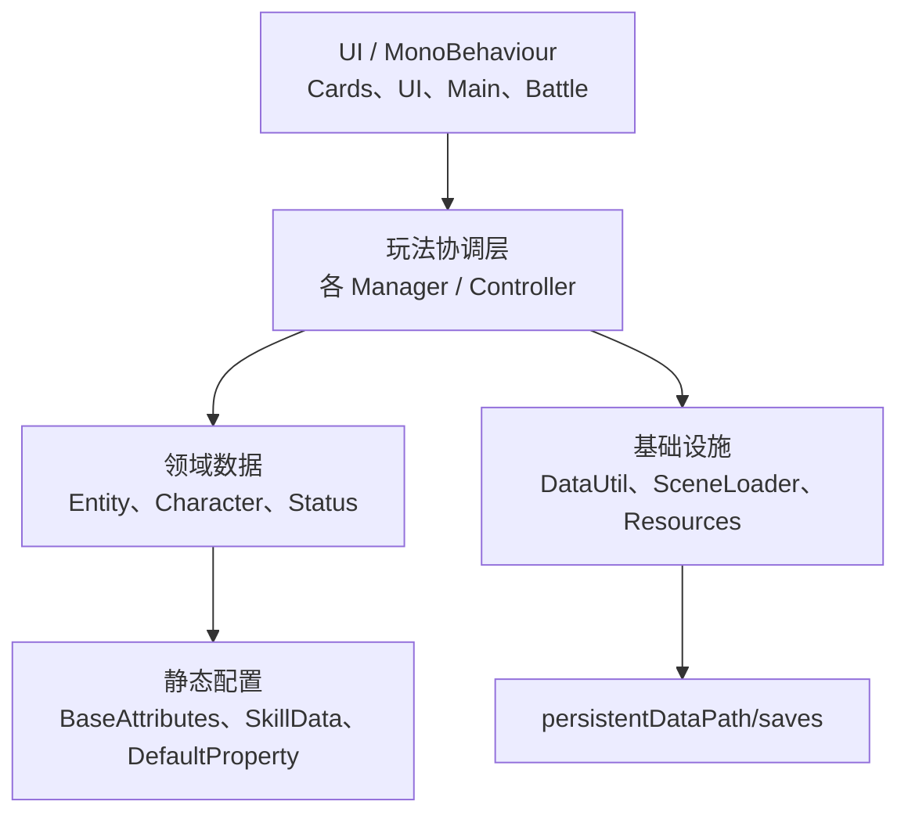
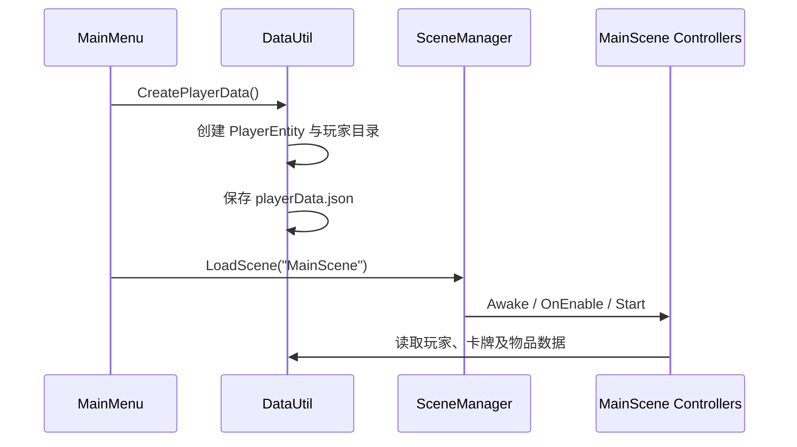

# 架构总览

## 分层

### 表现层

场景中的 `MonoBehaviour` 接收按钮、拖拽和 Unity 生命周期事件，更新预制体和面板。大部分 Inspector 引用都是公开字段或 `[SerializeField]` 字段。

### 玩法协调层

项目使用多个 `*Manager`/`*Controller` 单例协调系统。例如 `CardListManager` 管理卡牌集合，`BattleController` 驱动战斗协程，`DataUtil` 负责存档。

### 领域层

`Entity` 下的普通可序列化类保存状态；`Characters` 下的类封装角色攻击行为。`CardEntity` 是最核心的领域对象。

### 基础设施层

- `DataUtil`：JSON 序列化、可选 Base64、存档路径。
- `SceneLoader`：同步加载和带 Animator 的过场加载。
- `Resources.Load`：基础属性、技能、图片和战斗特效。

## 关键单例及生命周期

| 类型 | 跨场景保留 | 说明 |
| --- | --- | --- |
| `DataUtil` | 是 | 在 `Awake` 初始化存档根目录 |
| `GameStatusManager` | 是 | 保存当前菜单/场景和战斗状态 |
| `SceneLoader` | 是 | 场景加载入口 |
| `CardListManager` | 是 | 卡牌列表跨场景供战斗读取 |
| `BattleReportManager` | 是 | 战报图表 |
| 其他多数 Manager | 否 | 绑定在具体场景中 |

单例实现目前并不统一：有的销毁重复对象，有的只在 `Instance == null` 时赋值，有的会使用 `FindAnyObjectByType`。新增代码不应假设所有单例一定存在，应在跨场景或可选系统边界进行空值检查。

## 初始化顺序

典型新游戏：

需要特别注意 Unity 的 `Awake → OnEnable → Start` 顺序，以及同阶段不同 GameObject 之间顺序未显式保证。跨组件初始化不要依赖另一个对象的 `Start` 已经执行。

## 当前耦合方式

- 直接访问静态 `Instance`；
- 通过 Inspector 连接按钮、面板、Prefab 和 Transform；
- 通过 `Resources.Load` 使用字符串路径；
- 通过 `CurrentScene` 枚举驱动主界面面板；
- 通过 `JsonUtility` 包装列表并序列化。

当前没有第一方 `.asmdef`，因此 `Assets/Resources/Scripts` 基本编译进 `Assembly-CSharp`。这会扩大编译范围，也不利于独立单元测试。
