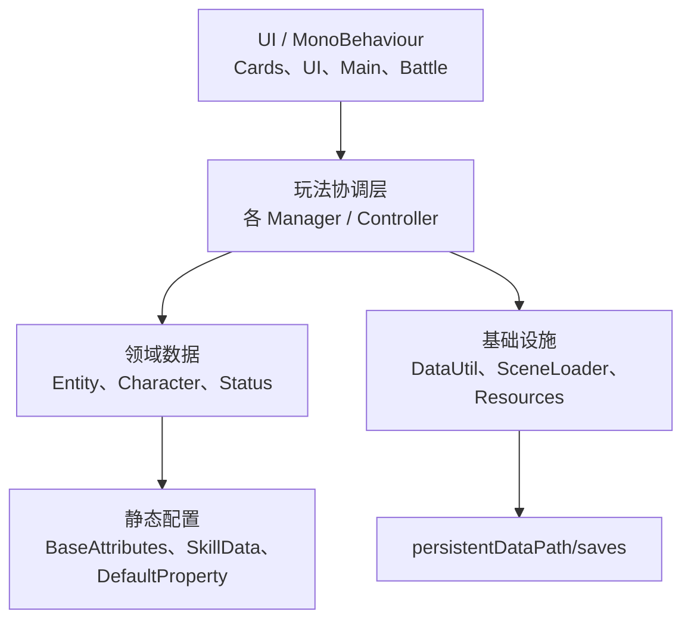
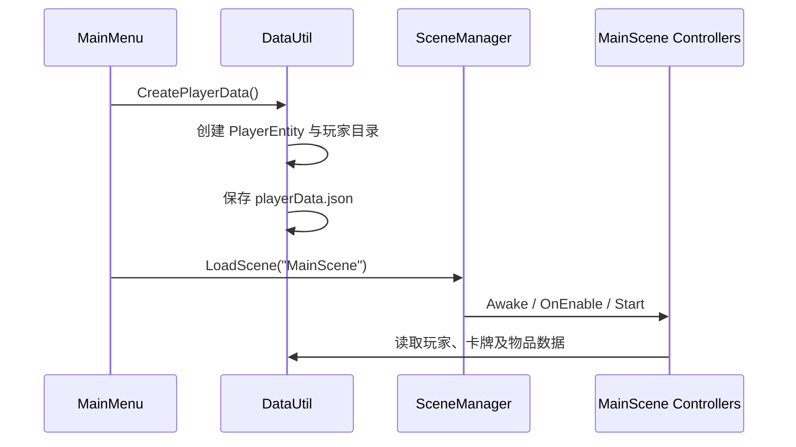

# 项目结构与架构
> 文档版本：v1.0
> 文档类型：**工程**
> 由原 `04-project-structure` + `05-architecture` 合并。
> 状态见 [PRODUCT-STATUS.md](PRODUCT-STATUS.md)。

---

## 项目结构

### 根目录

```text
Galactic Frontier/
├─ Assets/
│  ├─ Resources/              # 第一方运行时代码、场景、预制体和数据
│  ├─ Plugins/                # 第三方插件
│  ├─ Packages/               # 导入的美术/工具资源，不等同于 UPM Packages
│  ├─ TextMesh Pro/           # TMP 示例和资源
│  ├─ LeanTween/              # Tween 库和示例
│  └─ JMO Assets/             # Cartoon FX 等第三方资源
├─ Packages/                  # Unity Package Manager 配置
├─ ProjectSettings/           # Unity 项目设置
├─        # 本文档
└─ README.md                  # 原项目展示说明
```

一般业务修改应限制在 `Assets/Resources`。除非任务明确要求，不要重构第三方资源目录。

### 第一方脚本

| 目录 | 职责 | 代表类型 |
| --- | --- | --- |
| `Achievement` | 成就和徽章 UI | `AchievementController` |
| `Battle` | 战斗循环、Buff/Debuff、编队、战报 | `BattleController`, `LineupManager` |
| `Battle/Domain` | 可测纯结算（asmdef `GalacticFrontier.BattleDomain`） | `BattleRng`, `CombatMath`, `BattleOutcomeRules` |
| `Deck` / `Deck/Domain` | 多卡组编制、占用与调度（asmdef `GalacticFrontier.DeckDomain`） | `DeckService`, `DeckRules`, `ActionScheduler` |
| `World` / `World/Domain` | 区域进度、舰船门、遭遇与 AFK（asmdef `GalacticFrontier.WorldDomain`） | `WorldService`, `ShipService`, `IdleCombatTicker` |
| `Tests/EditMode` | EditMode 领域测试 | `CombatMathTests`, `DeckRulesTests`, `WorldRulesTests` |
| `Cards` | 卡牌生成、展示、列表、抽卡结果 | `CardDataManager`, `CardListManager`, `Card` |
| `CharacterPanel` | 角色面板、技能、移动 | `CharacterInfoManager`, `SpellController` |
| `Characters` | 各角色战斗行为 | `Character`, `Asra`, `Magki`, `Sernia` |
| `Entity` | 可序列化领域模型 | `CardEntity`, `PlayerEntity`, `ItemEntity` |
| `Inventory` | 本地/远程物品和背包 UI | `InventoryItemManagerBase`, `ItemManager` |
| `Main` | 主菜单、加载存档、主界面导航和全局状态 | `MainMenu`, `GameStatusManager` |
| `Planet` | 星球列表和详情 | `PlanetListManager`, `PlanetDetailManager` |
| `Scene` | 场景加载与场景效果 | `SceneLoader` |
| `Settings` | 保存、清空卡牌、礼品码和设置面板 | `SettingsManager` |
| `Shop` | 抽卡材料选择 | `CardDrawingManager` |
| `UI` | 可复用 Slot、交互和面板控制器 | `ItemSlot`, `PortraitSlot`, `RadarSystem` |
| `Utils` | 存档、图片、加密、定位和选择工具 | `DataUtil`, `ImageUtil`, `TargetSelector` |
| `Utils/Save` | Dev Data、存档版本/迁移、Starter Seed（P0.1/P0.2） | `DevDataSettings`, `SaveMigrator`, `StarterSeedApplier` |

### Resources 约定

因为 `Assets/Resources` 是 Unity 的特殊目录，运行时调用 `Resources.Load` 时路径：

- 从 `Resources/` 的下一层开始；
- 不包含扩展名；
- 大小写和目录名应与资源一致。

当前示例：

```csharp
Resources.Load<TextAsset>("data/BaseAttributes");
Resources.Load<GameObject>("Prefabs/Effect/Bleeding");
Resources.Load<Sprite>("Images/Default");
```

### 场景中的主要第一方组件

#### MainMenuScene

`DataUtil`、`GameStatusManager` 和 `SceneLoader` 在这里创建并跨场景保留；`MainMenu` 与 `GameLoadManager` 负责入口 UI。

#### MainScene

包含绝大多数玩法控制器：卡牌列表与预览、编队、抽卡、背包、星球雷达、角色信息、事件、设置和调试面板。

#### BattleScene

包含 10 个 `Card` 视图（双方各 5 个位置）、`BattleController`、`BattleInfo`、`BattleReportManager`、`CardDataManager` 和效果管理器。

#### HomeScene

包含移动、漂浮物和背景循环等早期原型组件；当前未加入构建。

## 架构总览

### 分层



#### 表现层

场景中的 `MonoBehaviour` 接收按钮、拖拽和 Unity 生命周期事件，更新预制体和面板。大部分 Inspector 引用都是公开字段或 `[SerializeField]` 字段。

#### 玩法协调层

项目使用多个 `*Manager`/`*Controller` 单例协调系统。例如 `CardListManager` 管理卡牌集合，`BattleController` 驱动战斗协程，`DataUtil` 负责存档。

#### 领域层

`Entity` 下的普通可序列化类保存状态；`Characters` 下的类封装角色攻击行为。`CardEntity` 是最核心的领域对象。

#### 基础设施层

- `DataUtil`：JSON 序列化、可选 Base64、存档路径。
- `SceneLoader`：同步加载和带 Animator 的过场加载。
- `Resources.Load`：基础属性、技能、图片和战斗特效。

### 关键单例及生命周期

| 类型 | 跨场景保留 | 说明 |
| --- | --- | --- |
| `DataUtil` | 是 | 在 `Awake` 初始化存档根目录 |
| `GameStatusManager` | 是 | 保存当前菜单/场景和战斗状态 |
| `SceneLoader` | 是 | 场景加载入口 |
| `CardListManager` | 是 | 卡牌列表跨场景供战斗读取 |
| `BattleReportManager` | 是 | 战报图表 |
| 其他多数 Manager | 否 | 绑定在具体场景中 |

单例实现目前并不统一：有的销毁重复对象，有的只在 `Instance == null` 时赋值，有的会使用 `FindAnyObjectByType`。新增代码不应假设所有单例一定存在，应在跨场景或可选系统边界进行空值检查。

### 初始化顺序

典型新游戏：



需要特别注意 Unity 的 `Awake → OnEnable → Start` 顺序，以及同阶段不同 GameObject 之间顺序未显式保证。跨组件初始化不要依赖另一个对象的 `Start` 已经执行。

### 当前耦合方式

- 直接访问静态 `Instance`；
- 通过 Inspector 连接按钮、面板、Prefab 和 Transform；
- 通过 `Resources.Load` 使用字符串路径；
- 通过 `CurrentScene` 枚举驱动主界面面板；
- 通过 `JsonUtility` 包装列表并序列化。

当前没有第一方 `.asmdef`，因此 `Assets/Resources/Scripts` 基本编译进 `Assembly-CSharp`。这会扩大编译范围，也不利于独立单元测试。
