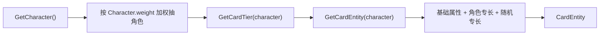

# 核心系统实现

## 1. 玩家与主菜单

入口为 `Main/MainMenu.cs`：

- 新游戏：`DataUtil.CreatePlayerData()` 创建带 GUID 的 `PlayerEntity`，保存后加载 `MainScene`。
- 加载游戏：显示存档面板，`GameLoadManager.LoadGame()` 从每个玩家目录读取数据并创建 `GameLoadSlot`。
- 选中存档：`DataUtil.SetCurrentPlayer()` 更新当前玩家及相关文件路径。

`MainScrollController` 在 `MainScene` 中创建菜单项，使用 `CurrentScene` 枚举切换各子面板，并同步更新 `GameStatusManager.CurrentScene`。

## 2. 卡牌数据生成

`CardDataManager` 在 `Awake` 初始化：

1. 角色实现列表：`Asra`、`Magki`、`Sernia`；
2. `SkillData_encrypted.bytes` 中的技能；
3. `BaseAttributes.json` 中的等级基础属性；
4. 职业属性权重；
5. 卡牌稀有度基础概率。

生成流程：



`GetAdjustedTierProbabilities(level)` 会随等级增加高稀有度概率、降低低稀有度概率。`WeightedRandom` 按字典权重进行选择。

## 3. CardEntity 属性模型

`CardEntity` 同时保存：

- 身份：GUID、卡名、角色、职业、稀有度；
- 成长：等级、经验、进化状态、战力；
- 基础战斗属性：生命、攻击、防御、命中、闪避、暴击、暴伤、减伤、能量恢复、速度；
- 编队位置；
- 普通专长、角色专长和技能。

属性按三个倍率字典分层：

```text
面板属性 = 基础值 × characterAttrs × panelAttrs
战斗属性 = 面板属性 × battleAttrs
```

- `characterAttrs`：角色固有专长；
- `panelAttrs`：卡牌专长等常驻修正；
- `battleAttrs`：战斗期间 Buff/Debuff 修正。

属性 Setter 会重新计算战力。升级和数据变更通过 `OnDataChanged`、`OnCardUpgraded` 事件通知视图。

## 4. 卡牌列表、预览与编队

`CardListManager`：

- 从 `DataUtil.LoadCardData()` 初始化列表；
- 根据实体数量增减 `Card` GameObject；
- 支持排序、职业过滤、查找、添加和删除；
- `GetInLineCardEntities()` 返回已设置编队位置的卡牌；
- 更新列表后调用 `DataUtil.SaveCardData()`。

`LineupManager` 管理 5 个 `PortraitSlot`：

- 点击槽位后记录 `selectedIndex`；
- `DropZoneHandler` 接收拖入的卡牌；
- `AddLineupCard` 更新目标槽位及 `CardEntity.position`；
- 战斗场景按 `LineupPosition` 将卡牌放到相同索引。

## 5. 抽卡

当前抽卡分为两个阶段：

1. `CardDrawingManager` 选择 1 次或 10 次抽取，预扣材料；
2. `CardResultManager.InitCards(drawCount)` 调用 `CardDataManager` 生成结果并展示统计。

`CardDrawingManager` 材料仅在 **Dev Data Mode** 下由 `IDevDataProvider.FillSampleGachaMaterials` 注入（内存，不写档）；正式模式材料列表为空，待接真实背包。确认抽卡后，生成的卡牌仍会进入 `CardListManager` 并保存（Dev 样例结果同理，日志前缀 `[DEV-DATA]`）。

## 6. 战斗

`BattleController` 的主要流程：

1. 从持久化的 `CardListManager` 或存档读取玩家编队；
2. 敌方：仅 Dev Data Mode 下由 `IDevDataProvider.CreateSampleEnemyParty` 生成最多 5 张；正式模式空槽，待 P2.3 遭遇表；
3. 隐藏未使用位置并初始化双方 `Card`；
4. 每回合按 `Speed` 降序行动；
5. 能量满时使用 `SpecialAttack`，否则使用 `NormalAttack`；
6. 判断任一方是否全部阵亡；
7. 达到胜负或最大回合数后显示战报；Confirm 返回 MainScene Explore（`AppScreen.Battle`），Esc 中途返回舰桥。  
8. 伤害命中/暴击使用 `BattleRng`（`BattleController.BattleSeed`）；公式在 `CombatMath`，EditMode 可回归。

伤害核心：

```text
命中率 = clamp(攻击方命中 - 防守方闪避, 0, 1)
减伤率 = clamp(log₁.₄(max(防御, 1)) × 0.01 + 固定减伤, 0, 1)
伤害 = 战斗攻击 × 暴击倍率 × (1 - 减伤率) × 技能倍率
```

`Character` 是抽象策略：

- `NormalAttack(Card, List<Card>)`
- `SpecialAttack(Card, List<Card>)`
- `PassiveSkill(Card, List<Card>)`
- `GetPossibleTiers()`

新增角色时应实现以上行为，并同步更新 `CharacterName`、`CardDataManager.InitCharacterList()`、技能数据和图片资源。

## 7. Buff、Debuff 与特效

- `BuffManager` 合并或追加 Buff，并在回合更新时减少持续时间。
- `DebuffManager` 添加 Debuff、修改目标卡牌并刷新 UI。
- `CardEffectManager` 在启动时通过固定 Resources 路径载入特效 Prefab。
- 角色攻击协程负责播放效果、等待攻击间隔并应用伤害/状态。

## 8. 物品与远程仓库

`InventoryItemManagerBase` 封装本地和远程物品共有实现：

- 创建 Slot；
- 添加、消耗、排序和过滤；
- 容量与索引检查；
- 刷新 Slot；
- 转移时复制实体，避免两个背包共享同一个可变对象。

派生类：

- `ItemManager`：`IsRemote == false`；
- `RemoteItemManager`：`IsRemote == true`。

`ItemOperationManager` 负责删除和延迟传送。本地/远程已分文件（`inventory_local.json` / `inventory_remote.json`）；启动不再写 FakeData。详见 `05-data-and-save.md`。

## 9. 星球与事件

`RadarSystem` 在 UI 范围内生成星球和星点，负责焦点与坐标映射。`PlanetListManager`/`PlanetDetailManager` 展示列表与详情，开始按钮加载 `BattleScene`。

`EventManager` 根据事件实体创建 `EventSlot`。当前星球和事件内容仍含原型/模拟数据。
