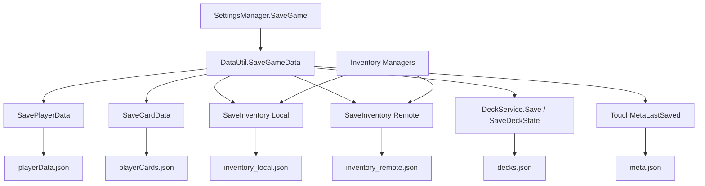

# 数据与存档

> 契约与 FakeData / 版本迁移规则见 [systems/08-save-and-seed-data.md](systems/08-save-and-seed-data.md)。  
> 存档字段与迁移实现快照见 [PRODUCT-STATUS.md](PRODUCT-STATUS.md) §4。

## Dev Data Mode（P0.1）

正式流程默认关闭样例 / FakeData，避免启动覆写玩家档：

| 开关 | 说明 |
| --- | --- |
| `DevDataSettings.Enabled` | 总开关；默认 `false` |
| EditorPrefs | `GalacticFrontier.DevData.enabled`（仅 Editor） |
| 启动参数 | `-devData` |
| 礼品码 | `001`（会话内切换；需重进相关界面才看到样例 UI） |
| `DefaultProperty.isDebug` | **只**控制明文 JSON / Base64，**不**打开 FakeData |

入口代码：`Assets/Resources/Scripts/Utils/Save/`（`DevDataSettings`、`IDevDataProvider`、`SaveMigrator`、`StarterSeedApplier` 等）。

## 存档位置（saveVersion = 4）

`DataUtil` 使用：

```text
Application.persistentDataPath/
└─ saves/
   ├─ playerEntities.json
   ├─ _corrupt/
   └─ <player-guid>/
      ├─ meta.json
      ├─ playerData.json
      ├─ playerCards.json
      ├─ inventory_local.json
      ├─ inventory_remote.json
      ├─ decks.json
      ├─ world.json                  // P2：区域进度
      ├─ ship.json                   // P2：舰船与模块
      ├─ idle.json                   // P3：离线结算 / Pending / 熟练度
      ├─ expertData.json
      ├─ avatar.png
      └─ itemData.json.bak
```

在当前 Windows 项目配置下，典型路径为：

```text
%USERPROFILE%/AppData/LocalLow/YeeStudio/Galactic Frontier/saves
```

所有路径应通过 `Path.Combine` 或 `DataUtil.GetPlayer*Path()` / `GetInventoryPath()` 构造，不要自行拼接 `/`。

## 初始化与当前玩家

- `DataUtil.Awake()` 设置单例、初始化 `saves` 根目录并调用 `DontDestroyOnLoad`。
- `CreatePlayerData()` 创建默认 `PlayerEntity`，写入 Starter Seed（本地）、空远程库存、默认 `decks.json` 与 `meta.json`（`saveVersion = 2`）。
- `SetCurrentPlayer()` 切换玩家后 `UpdatePaths()`，并运行 `SaveMigrator.EnsureCurrent`（无 meta 视为 v0 → … → 2）。
- 未设置有效当前玩家前，不应调用依赖玩家目录的卡牌、物品或专长读写。
- `_dev` / `_corrupt` 目录不会出现在读档列表中。

## 卡组 API（P1.1）

```text
DataUtil.SaveDeckState(PlayerDeckState state, bool touchMeta = true)
DataUtil.LoadDeckState() -> PlayerDeckState
DeckService.EnsureLoaded / CreateForNewPlayer / TryStart / TryStop
```

编制权威在 `DeckEntity.slotCardIds`；活跃战斗卡组成员会镜像到 `CardEntity.LineupPosition` 以兼容旧 UI/战斗。规则细节见 [systems/01-deck-and-occupation.md](systems/01-deck-and-occupation.md)。

## 库存 API

```text
DataUtil.SaveInventory(InventoryStore store, List<ItemEntity> items)
DataUtil.LoadInventory(InventoryStore store) -> List<ItemEntity>
enum InventoryStore { Local, Remote }
```

`SaveItemData` / `LoadItemData` 已标记 Obsolete（勿用于新代码）。  
`ItemManager` → Local；`RemoteItemManager` → Remote。变更会写对应 JSON 并刷新 `meta.lastSavedAtUtc`。

## 序列化格式

Unity `JsonUtility` 不直接序列化顶层列表，因此使用：

- `PlayerListWrapper`
- `CardListWrapper`
- `ItemListWrapper`（两侧库存共用）
- `ExpertiseListWrapper`
- `SkillListWrapper`
- `BaseAttrEntityWrapper`
- `SaveMeta`
- `PlayerDeckState`（直接序列化；内含 `List<DeckEntity>`）

`DefaultProperty.isDebug == true` 时保存明文 JSON；否则保存 Base64 文本。Base64 只是编码，不是安全加密。

写入走原子写：先写 `.{fileName}.tmp`，再 `File.Replace` / `Move` 到目标文件。

## 静态数据

| 文件 | 加载方式 | 用途 |
| --- | --- | --- |
| `Resources/data/BaseAttributes.json` | `Resources.Load<TextAsset>` | 各等级基础属性 |
| `Resources/data/SkillData_encrypted.bytes` | `EncryptionUtil` | 角色技能定义 |
| `Resources/data/SkillData.json` | 当前主要作为源数据/调试数据 | 可读技能数据 |
| `Resources/data/StarterSeed.json` | `StarterSeedApplier` | 新档本地教程材料（确定性） |
| `Galactic-Mock-Data - Asra.csv` | 未形成正式运行时管线 | 模拟/设计数据 |

修改静态 JSON 时：

1. 保持字段名与实体/Wrapper 完全一致；
2. 枚举通常以整数序列化，改变枚举顺序会改变旧数据含义；
3. 用 Unity 实际加载验证，不要只检查 JSON 语法；
4. 若明文源数据需要重新生成 `.bytes`，应确认当前加密/编码工具链。

## 保存调用关系



## 兼容性注意事项

- `JsonUtility` 主要处理字段，不处理普通 C# 属性；需要持久化的状态必须确认存在序列化字段。
- `CardEntity` 包含运行时字典和事件，这些不会由 `JsonUtility` 保存；加载后需要依赖构造/初始化逻辑重建。
- `readonly` 字段、事件和字典不应被当作存档格式的一部分。
- 旧档仅有 `itemData.json` 时，选档会自动拆分为 local/remote 并生成 `meta.json`；原文件改名为 `itemData.json.bak`。
- `saveVersion = 1` 且无 `decks.json` 时，Migrator 1→2 从 `playerCards` 的 `LineupPosition` 生成默认战斗卡组。
- `saveVersion` 高于游戏支持时拒绝加载（见 `DataUtil.LastSaveError`）。
