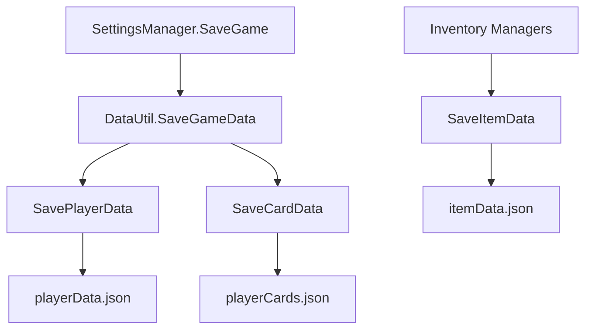

# 数据与存档

## 存档位置

`DataUtil` 使用：

```text
Application.persistentDataPath/
└─ saves/
   ├─ playerEntities.json
   └─ <player-guid>/
      ├─ playerData.json
      ├─ playerCards.json
      ├─ itemData.json
      ├─ expertData.json
      └─ avatar.png
```

在当前 Windows 项目配置下，典型路径为：

```text
%USERPROFILE%/AppData/LocalLow/YeeStudio/Galactic Frontier/saves
```

所有路径应通过 `Path.Combine` 或 `DataUtil.GetPlayer*Path()` 构造，不要自行拼接 `/`。

## 初始化与当前玩家

- `DataUtil.Awake()` 设置单例、初始化 `saves` 根目录并调用 `DontDestroyOnLoad`。
- `CreatePlayerData()` 创建默认 `PlayerEntity`，其 `playerID` 为新 GUID。
- `SetCurrentPlayer()` 切换玩家后调用 `UpdatePaths()`。
- 未设置有效当前玩家前，不应调用依赖玩家目录的卡牌、物品或专长读写。

## 序列化格式

Unity `JsonUtility` 不直接序列化顶层列表，因此使用：

- `PlayerListWrapper`
- `CardListWrapper`
- `ItemListWrapper`
- `ExpertiseListWrapper`
- `SkillListWrapper`
- `BaseAttrEntityWrapper`

`DefaultProperty.isDebug == true` 时保存明文 JSON；否则保存 Base64 文本。Base64 只是编码，不是安全加密，不能用于保护密钥或敏感数据。

## 静态数据

| 文件 | 加载方式 | 用途 |
| --- | --- | --- |
| `Resources/data/BaseAttributes.json` | `Resources.Load<TextAsset>` | 各等级基础属性 |
| `Resources/data/SkillData_encrypted.bytes` | `EncryptionUtil` | 角色技能定义 |
| `Resources/data/SkillData.json` | 当前主要作为源数据/调试数据 | 可读技能数据 |
| `Galactic-Mock-Data - Asra.csv` | 未形成正式运行时管线 | 模拟/设计数据 |

修改静态 JSON 时：

1. 保持字段名与实体/Wrapper 完全一致；
2. 枚举通常以整数序列化，改变枚举顺序会改变旧数据含义；
3. 用 Unity 实际加载验证，不要只检查 JSON 语法；
4. 若明文源数据需要重新生成 `.bytes`，应确认当前加密/编码工具链。

## 保存调用关系



## 兼容性注意事项

- `JsonUtility` 主要处理字段，不处理普通 C# 属性；需要持久化的状态必须确认存在序列化字段。
- `CardEntity` 包含运行时字典和事件，这些不会由 `JsonUtility` 保存；加载后需要依赖构造/初始化逻辑重建。
- `readonly` 字段、事件和字典不应被当作存档格式的一部分。
- 重命名字段、枚举或文件名时应提供迁移策略，否则旧存档会静默丢失数据或采用默认值。
- 保存写入目前不是原子操作；程序中断可能留下不完整 JSON。
