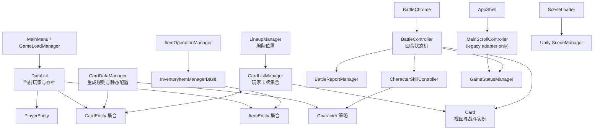
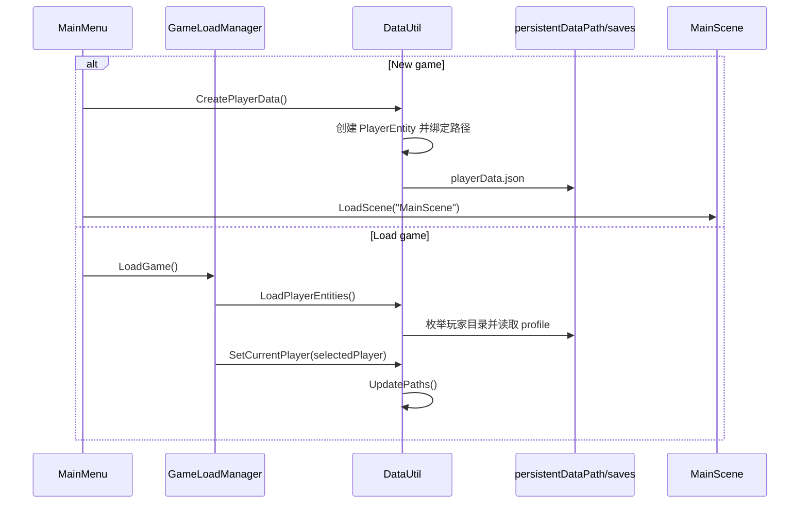
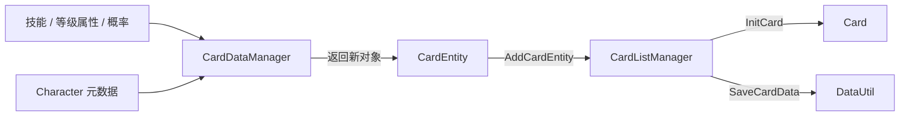
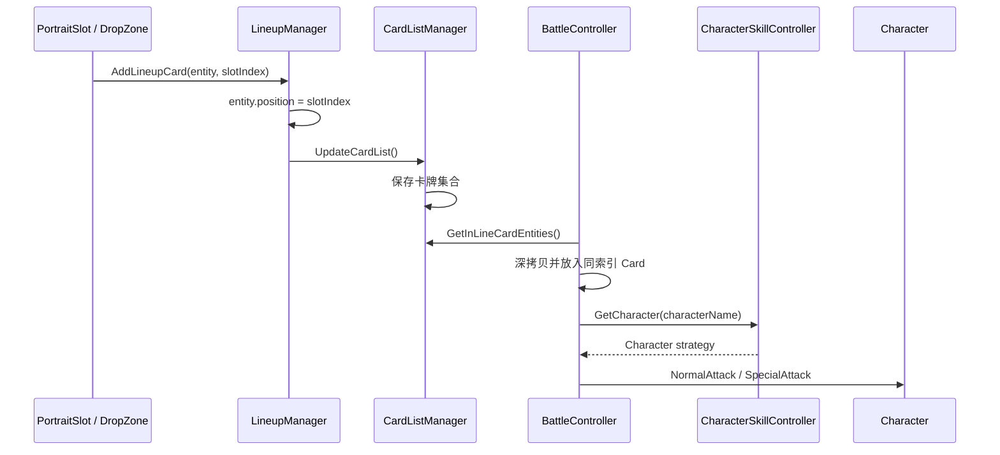
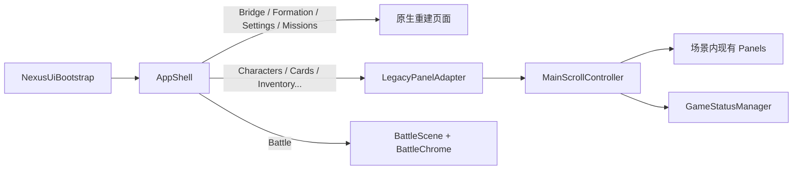

# 核心类职责与关系

本文从“谁拥有数据、谁协调流程、谁只负责显示”的角度描述项目核心类。修改功能前，先找到数据所有者，再沿调用关系修改协调器和视图，避免把同一份状态复制到多个 Manager。

## 总体关系



图中的箭头表示主要调用或数据依赖，不代表对象一定由上游创建。大量组件仍由场景或 Prefab 通过 Inspector 装配。

## 核心类索引

| 类 | 层级 | 数据/状态所有权 | 主要协作者 | 关键约束 |
| --- | --- | --- | --- | --- |
| `DataUtil` | 基础设施 | 当前玩家、玩家存档路径、序列化入口 | `PlayerEntity`、`CardListManager`、`CharacterInfoManager` | 先选择 `currentPlayer`，再调用玩家范围的读写方法 |
| `GameStatusManager` | 全局状态 | 当前页面、是否战斗、是否抽卡 | `MainScrollController`、`BattleController` | 跨场景保留；不直接切换页面或场景 |
| `MainMenu` | 入口 UI | 无持久数据 | `DataUtil`、`GameLoadManager` | 新游戏成功后进入 `MainScene` |
| `GameLoadManager` | 入口协调 | 存档列表 UI 与当前焦点 | `DataUtil`、`GameLoadSlot` | 选中 Slot 时必须同步 `DataUtil.currentPlayer` |
| `MainScrollController` | 主界面协调 | 当前激活的旧版面板 | `GameStatusManager`、`AppShell` / `LegacyPanelAdapter` | `panels` 顺序与 `CurrentScene` 数值绑定；有 AppShell 时不建旧导航 |
| `AppShell` | UI 外壳 | 全局导航、Bridge/Formation/Settings/Missions 原生页、跨场景目标页 | `LegacyPanelAdapter`、`SceneManager` | 新页面自己渲染；未重写页委托旧面板 |
| `BattleChrome` | 战斗外壳 | 无战斗数据 | `BattleController.CurrentRound` | Option A：只改 chrome，不改手牌战斗 |
| `CardEntity` | 领域模型 | 卡牌身份、成长、基础属性、专长、编队位置 | `CardDataManager`、`DataUtil`、`Card` | 字段参与 JSON；属性变化可能触发整组卡牌保存 |
| `CardDataManager` | 领域服务 | 角色目录、技能、等级属性、概率表 | `Character`、`Resources`、`CardEntity` | 负责“生成”，不自动把卡加入玩家集合 |
| `CardListManager` | 集合协调 | 当前玩家的卡牌列表及 Card 视图池 | `DataUtil`、`Card`、`CardPreviewController` | 跨场景保留；编队卡不会显示在普通卡牌网格中 |
| `Card` | 表现/战斗实例 | 临时生命、能量、动画、战报统计引用 | `CardEntity`、Buff/Debuff、特效系统 | 使用前调用 `InitCard`；不应成为持久成长数据源 |
| `LineupManager` | 编队协调 | Slot 选择状态 | `PortraitSlot`、`CardListManager` | Slot 索引等于 `LineupPosition` 和战斗站位索引 |
| `Character` | 战斗策略 | 单个角色的攻击行为与生成权重 | `BattleController`、`CardDataManager` | 新角色需要同时注册枚举、策略、资源和技能数据 |
| `CharacterSkillController` | 策略注册表 | `CharacterName → Character` 映射 | `BattleController` | 每场战斗初始化后才能查询 |
| `BattleController` | 战斗协调 | 回合、行动顺序、战斗结束条件 | `Card`、`Character`、`GameStatusManager` | 使用玩家卡牌的深拷贝，避免污染持久数据 |
| `InventoryItemManagerBase` | 集合协调 | 本地或远程物品列表及 Slot | `DataUtil`、`ItemSlot` | 派生类通过 `IsRemote` 区分所有权；转移时复制实体 |
| `ItemOperationManager` | 物品流程 | 当前操作对象与传送进度 | `ItemManager`、`RemoteItemManager` | 不直接拥有物品集合 |
| `SceneLoader` | 基础设施 | 可选过场动画状态 | Unity `SceneManager` | 跨场景保留；场景名必须存在于 Build Settings |

## 1. 启动与存档链路



`DataUtil` 是唯一应负责拼接玩家存档路径的类。业务 Manager 应调用 `SaveCardData`、`SaveInventory` 等明确入口，不应自行假设目录结构。

## 2. 卡牌生成、持有与显示

这三个概念必须分开：

- `CardDataManager` 根据概率和静态配置生成一张新的 `CardEntity`。
- `CardListManager` 持有玩家当前的 `CardEntity` 集合，并负责保存。
- `Card` 是场景里的 MonoBehaviour，用于渲染、交互和战斗临时状态。



调用 `GetCardEntity()` 不代表玩家已经获得该卡；抽卡确认后仍需显式调用 `CardListManager.AddCardEntity()`。

### CardEntity 属性层

```text
PanelAttribute = BaseValue × CharacterMultiplier × PanelMultiplier
BattleAttribute = PanelAttribute × BattleMultiplier
```

- `characterAttrs`：角色固有专长。
- `panelAttrs`：卡牌专长等持久修正。
- `battleAttrs`：Buff/Debuff 等战斗临时修正。

`OnDataChanged` 用于刷新视图，`OnCardUpgraded` 用于进阶后的专门反馈。当前 `CalculatePower()` 还会通过 `CardListManager` 保存整个集合，因此在初始化阶段批量设置属性时会产生较强的单例与 I/O 耦合。

## 3. 编队到战斗



`LineupPosition.None` 表示未编队。有效枚举值会直接转换为 `playerCards` 的索引，因此修改枚举或 Slot 数量时必须同时检查场景中的卡牌槽位。

## 4. 战斗职责边界

`BattleController` 负责：

- 初始化双方卡牌；
- 每回合按速度排序；
- 选择普通攻击或特殊攻击；
- 检查存活与最大回合数；
- 打开战报。

`Character` 负责某个角色一次行动中的具体行为，包括目标选择、动画等待、伤害和状态效果。`Card` 负责显示与临时生命/能量。不要把角色特有逻辑继续堆入 `BattleController`。

## 5. 主界面与 AppShell UI



`AppShell` 是表现层宿主，不是卡牌/物品数据所有者。战斗采用 Option A：保留 `BattleController` 自动战斗，仅由 `BattleChrome` 提供 Figma 风格边框与 HUD。

## 6. 物品系统

`InventoryItemManagerBase` 同时承担集合与 Slot 显示逻辑：

- `ItemManager` 表示玩家本地背包；
- `RemoteItemManager` 表示远程仓库；
- `ItemOperationManager` 负责删除和延迟传送操作。

物品转移使用新的 `ItemEntity` 副本，避免两个背包共享可变对象。本地/远程分文件持久化（P0.2）；`ItemManager` ↔ `inventory_local.json`，`RemoteItemManager` ↔ `inventory_remote.json`。

## 生命周期和单例注意事项

| 阶段 | 典型行为 | 风险 |
| --- | --- | --- |
| `Awake` | 建立 `Instance`、读取静态配置、初始化路径 | 同一阶段不同 GameObject 的顺序未保证 |
| `OnEnable` | 发布当前场景状态、加载或刷新列表 | 对象重复启用可能重复执行 I/O |
| `Start` | 绑定按钮、创建 Slot、启动战斗 | 依赖对象的 `Start` 可能尚未运行 |
| 场景切换 | `DontDestroyOnLoad` 对象继续存在 | 场景内重复单例必须销毁或复用 |

跨系统调用前应验证可选单例是否存在。不要仅因为某组件存在于一个场景，就假设从其他场景直接进入时它也已初始化。

## 修改入口速查

| 需求 | 数据所有者 | 主要协调器 | 视图/外壳 |
| --- | --- | --- | --- |
| 新增玩家字段 | `PlayerEntity` / `DataUtil` | `MainMenu`、角色信息 Manager | 对应 UI |
| 新增角色 | `CharacterName`、具体 `Character` | `CardDataManager`、`CharacterSkillController` | 图片、技能和卡牌 Prefab |
| 修改卡牌成长 | `CardEntity`、等级配置 | `CardDataManager`、`CardListManager` | `CardPreviewController` |
| 修改编队规模 | `LineupPosition` | `LineupManager`、`BattleController` | `PortraitSlot`、战斗槽位 |
| 修改战斗回合 | `Card` 临时状态 | `BattleController`、具体 `Character` | `BattleInfo`、战报 |
| 修改物品存档 | `ItemEntity`、`DataUtil` | 本地/远程 Item Manager | `ItemSlot` |
| 新增主导航页 | 对应业务模型 | 对应业务 Controller | `AppShell`、必要时 `LegacyPanelAdapter` |

## 面向 Codex 的检查清单

1. 找到领域实体或集合 Manager，确认真正的数据所有者。
2. 检查目标类是否跨场景保留，以及重复单例如何处理。
3. 搜索事件订阅、Inspector 字段、`Resources.Load` 路径和枚举到索引的转换。
4. 修改实体字段前检查已有 JSON 存档兼容性。
5. 修改编队或主菜单枚举前检查场景数组顺序。
6. 修改流程后同步更新本文档和对应专题文档。
7. 至少执行 C# 编译、`git diff --check` 和目标场景冒烟测试。
