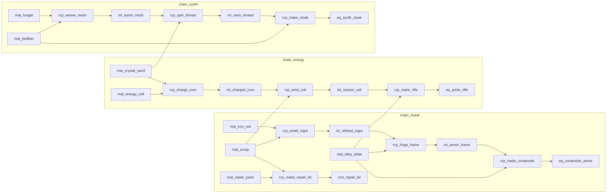

# 经济：生产、品质、资源表与耐久
> 文档版本：v1.0
> 文档类型：**规则 / 内容契约**
> 由原 `18-production-and-quality` + `22-resources-and-warehouse` + `19-durability-and-repair` 合并。
> 状态见 [PRODUCT-STATUS.md](PRODUCT-STATUS.md)。
> 世界观解释见 `03-worldbuilding.md` §8。

---

## 生产链与品质

### 1. 目标与非目标

#### 1.1 目标

打通「采集 → 加工 → 成品」的本地可验证生产循环，并让**品质**成为可培养、可预期的结果，而非纯赌运气：

- MVP 至少 **3 条完整生产链**（原料→中间→成品）；
- **15–20 种资源**可堆叠入库；
- **10–15 件装备/模块**可制造并带品质；
- 玩家能通过技能、设施、材料与保底手段**抬高最低品质**；
- 品质影响属性、耐久上限、维修成本与市场价值。

#### 1.2 非目标

- 离线时长与 `PausedBlock` 时钟语义 → `14-idle-and-offline.md`
- 耐久损耗与维修扣料公式 → `15-economy.md`
- 市场撮合与卡牌上架 → `16-market-and-card-trade.md`
- 装备强化失败、永久损毁、自由星球建造（核心设计明确排除）
- 复杂跨区物流损耗（非 MVP）

---

### 2. 术语

| 术语 | 定义 |
| --- | --- |
| **资源（Resource）** | 可堆叠材料/中间件/消耗品，以 `itemDefId + quality` 为堆叠键（见 §4.4） |
| **配方（Recipe）** | 输入材料、产出、工时、设施要求、品质权重的静态配置 |
| **生产链（Chain）** | 至少两步配方串联：原料 → 中间 → 成品（或模块） |
| **加工（Process）** | 材料→材料的中间步骤；行动类型可用 `Process` |
| **制造（Manufacture）** | 产出装备/模块/高阶消耗品；行动类型可用 `Manufacture` |
| **品质（Quality）** | 离散档位；影响属性与价值，见 §4.3 |
| **设施（Facility）** | 舰船工坊等级；提供速度/品质加成与配方解锁 |
| **熟练度（Mastery）** | 每配方累计成功次数带来的品质/速度小幅加成 |
| **批次（Batch）** | 一次完整周期产出 1 件（或配置的 `outputQty`）成品 |
| **手动制造（Manual Craft）** | 玩家指派 `Produce` 卡组执行配方；占用人手；有完整周期 |
| **自动化流水线（Production Line）** | 港口/前哨安装的固定产线；**不占**卡组；玩家仅启用/停用与升级 |
| **流水线品类（Line Family）** | 产线可制造的**产品族**；同类近亲产物共用一条线（如冶炼线出铜锭/铁锭） |
| **流水线设计图（Line Blueprint）** | 建造或解锁某品类流水线的静态配置 |

MVP 实现可将 `Process` 与 `Manufacture` 合并为卡组用途 `Produce`，但配方表仍区分 `recipeKind`。

---

### 3. 硬约束（不可违背）

1. 生产行动必须由**独立卡组**执行，遵守占用与并行上限。  
2. **生产品质必须影响制造结果与市场价值**（§22）。  
3. 品质不得完全由极低概率决定；须提供抬高最低品质的手段。  
4. 停止生产：占用立即解除；**已扣材料默认不返还**，未完成批次无产出（与占用文档一致，本文确认）。  
5. 材料不足或仓库满 → `PausedBlock`，不惩罚已产出。  
6. 首发循环可单人完成，不依赖公会订单。

---

### 4. MVP 拍板决议

> 关闭核心设计 §21「生产品质」待定项；数值进配置表，语义按本表。

#### 4.1 资源表规模与分类

| 项目 | MVP 默认 |
| --- | --- |
| 资源种数 | **18**（落在 15–20） |
| 装备/模块种数 | **12**（落在 10–15） |
| 物品大类 | `Material` / `Intermediate` / `Consumable` / `Equipment` / `ShipModule` |
| 堆叠 | 材料与中间件可堆叠；装备/模块默认 **不可堆叠**（每件独立实例，含耐久） |
| 权威 Id | `itemDefId`（静态定义）+ 实例 `itemInstanceId`（装备） |

#### 示例资源分布（可改名，保留结构）

| 链 | 原料 | 中间 | 成品 |
| --- | --- | --- | --- |
| 金属链 | 铁矿石、废合金 | 精炼锭、合金板 | 舰装护甲板、近战武器 |
| 能源链 | 结晶砂、冷却液 | 能芯单元 | 能量模块、护盾电容 |
| 生物/合成链 | 菌毯、溶剂 | 合成纤维 | 维修包、外勤夹克 |

采集节点产出原料；加工/制造消耗并转化。具体掉落量进节点表。

#### 4.2 三条完整生产链（验收最小集）

每条链至少配置：

1. 采集或战斗可得的 **原料**；  
2. 一步 **加工** 配方（原料→中间）；  
3. 一步 **制造** 配方（中间→装备或模块）；  
4. 成品可装备或可消耗，并进入维修/市场循环。

| ChainId | 名称 | 最小路径 |
| --- | --- | --- |
| `chain_metal` | 金属工坊 | 铁矿石 → 精炼锭 → 合金板 → 护甲板 |
| `chain_energy` | 能源工坊 | 结晶砂 → 能芯单元 → 能量模块 |
| `chain_synth` | 合成工坊 | 菌毯+溶剂 → 合成纤维 → 维修包 / 外勤夹克 |

设施挂钩（与舰船文档设施表对齐，可扩展）：

| 设施 | 解锁/加成 |
| --- | --- |
| 装甲工坊 | 金属链速度/品质；降低战斗耐久损耗（耐久文档） |
| 能源车间 | 能源链 |
| 合成舱 | 合成链；维修包产出 |

#### 4.3 品质档位

| 档位 Id | 显示名（中/英） | 排序 | MVP |
| --- | --- | --- | --- |
| `Q1` | 粗制 / Crude | 1 | 是 |
| `Q2` | 标准 / Standard | 2 | 是 |
| `Q3` | 精良 / Fine | 3 | 是 |
| `Q4` | 卓越 / Superior | 4 | 是 |
| `Q5` | 杰作 / Masterwork | 5 | 是（低概率+培养后可达） |

**不做**第六档神话级（避免 MVP 词条爆炸）。

#### 品质效果乘数（相对 Q2=1.0 的默认语义）

| 档位 | 主属性 | 耐久上限 | 工作效率* | 市场基准价 | 维修成本 |
| --- | --- | --- | --- | --- | --- |
| Q1 | 0.85 | 0.90 | 0.90 | 0.70 | 0.85 |
| Q2 | 1.00 | 1.00 | 1.00 | 1.00 | 1.00 |
| Q3 | 1.12 | 1.10 | 1.08 | 1.35 | 1.10 |
| Q4 | 1.25 | 1.20 | 1.15 | 1.80 | 1.25 |
| Q5 | 1.40 | 1.35 | 1.25 | 2.50 | 1.45 |

\*工作效率：工具/模块对采集或生产速度的加成；纯战斗装备可忽略该列。

附加效果（套装词条）MVP **可选**：Q4+ 才允许 1 条固定小词条；禁止每件随机稀有池导致市场 SKU 爆炸。

#### 4.4 堆叠与市场展示键

| 物品类型 | 堆叠键 | 说明 |
| --- | --- | --- |
| 材料 / 中间件 / 消耗品 | `(itemDefId, quality)` | 同定义同品质合并数量 |
| 装备 / 模块 | 不堆叠 | 每件 `itemInstanceId`；市场按「定义+品质」聚合盘口，成交交割具体实例 |

低品质与高品质**不可**合并堆叠，避免「平均品质」歧义。

#### 4.5 品质生成公式（可预期）

制造完成时：

```text
score = craftSkill
      + facilityBonus
      + deckWorkPower          // 卡组成员工程/生产属性平均或总和，配置选择
      + materialQualityBonus   // 输入材料品质贡献
      + masteryBonus
      + guaranteeBonus         // 保底/加料选项
      + noise                  // 小幅随机，默认 ±5 分，须可播种

quality = ScoreToQuality(score, recipe.thresholds)
quality = max(quality, recipe.minQualityFloor + playerFloorBonus)
quality = min(quality, recipe.maxQualityCap)
```

| 决议 | MVP |
| --- | --- |
| 随机性 | **有**，但权重低于培养项；同种子可复现（离线批量用 `hash(runSeed, batchIndex)`） |
| 最低品质地板 | 设施等级、熟练度、角色技能可提高 `minQualityFloor` |
| 保底制造 | 见 §4.6 |
| 材料品质 | 输入中**最低**材料品质提供地板；平均品质提供 `materialQualityBonus` |

`ScoreToQuality` 阈值示例（可配置）：

| 最低 score | 品质 |
| --- | --- |
| 0 | Q1 |
| 30 | Q2 |
| 55 | Q3 |
| 75 | Q4 |
| 95 | Q5 |

#### 4.6 保底、加料与再加工

| 手段 | 规则 |
| --- | --- |
| **保底档** | 配方可选 `guaranteeQuality`：额外消耗 `guaranteeExtraMaterials`（默认 +50% 主材料），使 `quality = max(rolled, guaranteeQuality)` |
| **高级设施稳定** | 设施 ≥ 阈值时，`noise` 减半且 `minQualityFloor` +1 档（不超过 Q4） |
| **拆解** | Q1–Q3 成品可拆解：返还主材料的 `salvageRatio`（默认 **40%**，按数量向下取整）；不返还保证加料 |
| **再加工** | 消耗「再加工试剂」+ 同定义低品质装备，重新走一次制造 roll，**可能升一档或不变**，不降档；每件生命周期最多再加工 `maxReforge`（默认 **1**） |

#### 4.7 生产行动与扣料时机

| 项目 | MVP 规则 |
| --- | --- |
| 启动 | `TryStart(Process|Manufacture, recipeId)`；校验设施等级、材料、并行与占用 |
| 扣料 | **启动时预扣**本批次全部材料（含保底加料） |
| 周期 | `cycleSeconds = recipe.baseSeconds / speedMultiplier` |
| 速度乘区 | 角色生产属性、设施、不满编效率（默认线性：`members/5`，下限 0.4） |
| 完成 | 产出写入仓库或 Pending；`mastery++`；若队列模式则尝试扣下一批材料 |
| 材料不足 | `PausedBlock`；已完成批次保留 |
| 仓库满 | `PausedBlock`；产出进 Pending（与离线文档一致） |
| **主动停止** | 占用立即解除；**已扣材料不返还**；当前批次产出 **0**；已完成批次不受影响 |

队列：MVP 允许「单卡组单配方重复批次」；不强制多配方队列 UI。

> **制造非瞬间完成**：无论手动或流水线，产出均须走完 `baseSeconds` 周期（受速度乘区影响）。不存在「点击即得」的制造（调试/任务特例除外）。

#### 4.8 采集产量（本文件补齐节点侧）

离线文档已定周期语义；此处定产量：

```text
yield = floor(node.baseYieldPerCycle
        * deckGatherMultiplier
        * facilityGatherBonus
        * qualityToolBonus)   // 采集工具品质
```

| 项目 | 默认 |
| --- | --- |
| `deckGatherMultiplier` | `1 + 0.05 * sum(gatherStat)` 或配置表，须可调 |
| 节点品质 | 原料默认产出 **Q2**；稀有节点可加权出 Q3 |
| 高风险节点 | 额外耐久损耗（耐久文档）；产量更高 |

#### 4.9 配方熟练度

| 项目 | MVP |
| --- | --- |
| 计数 | 每成功完成 1 批次 +1 |
| 效果 | 每 N 次（默认 10）+1 分 `masteryBonus`，软顶 +15 分 |
| 存档 | `recipeMastery[recipeId] = int` |

#### 4.10 手动工坊与自动化流水线

#### 4.10.1 设计原则

| 原则 | 定稿 |
| --- | --- |
| **非瞬间** | 所有制造/加工均有周期；材料在启动时预扣（手动与流水线一致，见 §4.7） |
| **早期手动** | 开局仅 **手动工坊**：须指派 `Produce` 卡组，占用人手完成批次 |
| **后期自动化** | 消耗资源、矿产、**流水线设计图** 建造固定产线；玩家**不逐批手操** |
| **玩家管理面** | 对每条流水线：**启用 / 停用**、选择当前配方（须在品类允许范围内）、**升级产线等级** |
| **专精** | 一条流水线只服务**特定产品族**；近亲产物共用同线，高级产物须**升级**或**另建高级线** |

叙事见 `03-worldbuilding.md` §4.4；内容表示例见 `09` §9。

#### 4.10.2 手动制造（Manual Craft）

| 项 | 规则 |
| --- | --- |
| 入口 | Crafting 屏 → 选配方 → `TryStart(Process\|Manufacture)` |
| 占用 | **占用**绑定 `Produce` 卡组全体成员（`01`） |
| 适用 | 新手教学、首配方解锁、小批量急单、尚未建线的配方 |
| 周期 | 与 §4.7 相同；角色工程属性、设施等级参与速度/品质 |
| 停止 | 占用立即解除；已扣料不退；当前批次无产出 |

MVP **仅实现**本形态；自动化为后 MVP 切片。

#### 4.10.3 自动化流水线（Automated Production Line）

| 项 | 定稿 |
| --- | --- |
| 建造 | `LineBlueprint` + 材料 + 矿产 + 港口工位（或 Cleared 星球工业湾） |
| 运行 | **不占用**卡组；后台按周期扣料产出 |
| 玩家操作 | ① 启用/停用 ② 在允许配方列表中选 **当前生产项** ③ 升级 `lineTier` |
| 暂停 | 缺料 / 仓库满 → `PausedBlock`（与 `04` 一致）；启用状态保留 |
| 离线 | 已启用且未 Paused 的流水线参与离线结算 |
| 品质 | 与手动共用 `QualityRules`；流水线 **无** 角色工程加成，靠产线等级 + 设施 + 材料 |

停用流水线：当前周期完成后停止下一批；**不**自动退还已预扣的本批材料（与手动停止语义对齐）。

#### 4.10.4 流水线品类与配方归属

每条流水线绑定一个 **`lineFamilyId`**。配方声明 `lineFamilyId` + `requiredLineTier`（或 `requiredLineDefId` 用于专用高级线）。

**同类近亲产物共用一条线** — 通过配方标签 `recipeTag` 归入同一品类：

| lineFamilyId | 中文 | 可共线产物示例 | 备注 |
| --- | --- | --- | --- |
| `line_smelting` | 冶炼流水线 | 铜锭、铁锭、精炼锭 | 输入矿石不同，同一冶炼周期模板 |
| `line_alloying` | 合金流水线 | 合金板、复合装甲坯 | 需中间锭 |
| `line_energy` | 能芯流水线 | 能芯单元、护盾电容芯 | 能源链 Process |
| `line_synth` | 合成流水线 | 合成纤维、溶剂精制 | 生物/化学中间件 |
| `line_weapon` | 武备流水线 | 脉冲步枪、穿甲刃 | Manufacture 武器族 |
| `line_module` | 模块装配线 | 装甲/反应堆/货仓模块物品 | 与 `mod_*` 设施成长并行 |

规则：

1. 启动配方时校验：`recipe.lineFamilyId == line.lineFamilyId` 且 `line.tier >= recipe.requiredLineTier`；  
2. **禁止**一条通用线生产所有物品；跨链成品须多条线并行；  
3. 玩家在同一冶炼线上切换「铜锭 / 铁锭」= 改 **当前配方**，非换线。

#### 4.10.5 升级产线 vs 建造高级专用线

| 路径 | 适用 | 说明 |
| --- | --- | --- |
| **升级现有线** | 同族 **中阶** 产物 | `line_smelting` T1→T2 解锁精炼锭；T2→T3 解锁合金 precursor |
| **新建高级专用线** | **高阶 / 机制** 产物 | 须独立 `LineBlueprint`，如 `line_phase_forge`（相位锻炉）、`line_entropy_purifier`（熵雾净化线） |
| 图纸来源 | — | 卡关稀有、秘境、NPC、阵营商店、Online 市场 |

示例（第七前沿）：

| 产物 | 最低要求 |
| --- | --- |
| 铁锭 / 铜锭 | `line_smelting` T1 |
| 精炼锭 | `line_smelting` T2 **或** 升级 T1→T2 |
| 复合装甲 | `line_alloying` T2 + `line_weapon` T1（多线协作） |
| 相位稳定模块 | **`line_phase_forge` T1**（专用蓝图；普通 `line_module` 不可代做） |

#### 4.10.6 与舰船设施模块的关系

| 层级 | 职责 |
| --- | --- |
| **舰船模块**（`mod_armor` 等） | 解锁手动配方、提供全局速度/品质加成；**不替代**流水线实体 |
| **流水线实例** | 独立槽位（港口 `dockWorkshopSlots`）；一条实例 = 一个品类 |
| **并行** | 多线可同时 Running；受工位数量与电力/维护（可选后 MVP）限制 |

手动制造仍受益于设施等级；自动化额外受益于 **`lineTier`**（每级 +速度、+品质地板，数值进配置表）。

#### 4.10.7 数据模型（流水线摘要）

```text
LineBlueprintDef
- lineDefId: string
- lineFamilyId: string
- displayNameKey: string
- tierCap: int
- buildCost: [{ itemDefId, qty }]
- buildSeconds: int
- allowedRecipeTags: string[]

ProductionLineInstance
- lineInstanceId: string
- lineDefId: string
- tier: int
- enabled: bool
- activeRecipeId: string | null
- state: Idle | Running | PausedBlock
- remainderSeconds: float
- locationId: string

RecipeDef（扩展字段，与 §5.2 合并）
- lineFamilyId?: string
- requiredLineTier: int
- requiredLineDefId?: string
```

#### 4.10.8 MVP 与迁移

| 阶段 | 范围 |
| --- | --- |
| **MVP（现状）** | 仅 **手动** `Produce` 卡组；周期制造；设施模块加成 |
| **MVP+** | 港口 1 条冶炼线 T1；启用/停用 + 选铜/铁锭 |
| **后 MVP** | 多线并行、星球工业湾、专用高级线、离线批量 |

实现时新增 `ProductionLineService`，与 `ProductionService` 共用扣料/品质/Pending 逻辑。

---

### 5. 数据模型（实现契约）

#### 5.1 ItemDef / 实例

```text
ItemDef
- itemDefId: string
- displayNameKey: string
- category: Material | Intermediate | Consumable | Equipment | ShipModule
- maxStack: int                 // 装备=1
- baseValue: int                // 市场基准（Q2）
- equipSlot?: string
- baseStats?: {}
- baseMaxDurability?: int
- repairMaterialId?: string
- tags[]

ItemInstance                    // 仅非堆叠
- itemInstanceId: string
- itemDefId: string
- quality: QualityTier
- durability: int
- maxDurability: int            // 受品质乘数
- reforgeCount: int
- bound: bool                   // 市场文档
```

堆叠仓位：

```text
ItemStack
- itemDefId: string
- quality: QualityTier
- quantity: int
```

#### 5.2 RecipeDef

```text
RecipeDef
- recipeId: string
- chainId: string
- recipeKind: Process | Manufacture
- inputs: [{ itemDefId, quantity, minQuality? }]
- output: { itemDefId, quantity }
- baseSeconds: int
- requiredFacilityId?: string
- requiredFacilityLevel: int
- scoreThresholds: { q2,q3,q4,q5 }
- minQualityFloor: QualityTier
- maxQualityCap: QualityTier
- guaranteeOptions?: [{ guaranteeQuality, extraInputMultiplier }]
- unlock?: { playerLevel?, chapterId?, regionCleared? }
```

#### 5.3 生产进度载荷

```text
ProduceProgress
- recipeId: string
- useGuarantee: bool
- remainderSeconds: float
- batchesCompleted: int
- runSeed: long
- batchIndex: int
```

权威服务建议：`ProductionService` + 配置 `Resources/data/recipes.json`、`items.json`。

---

### 6. 规则细则

#### 6.1 启动校验顺序

1. 卡组占用层 `TryStart` 通过；  
2. 配方已解锁、设施等级足够；  
3. 仓库可预扣材料；  
4. 输出目标空间：若完全无 Pending/仓库策略可用则拒绝或允许进 Pending（默认允许 Pending）。

#### 6.2 与卡组用途

| `DeckPurpose` | 可启动 |
| --- | --- |
| `Produce` / `Flexible` | Process、Manufacture |
| `Gather` | 仅 Gather |
| `Combat` | 不可生产 |

#### 6.3 验收用例

| 场景 | 期望 |
| --- | --- |
| 三条链各跑通原料→成品 | 仓库出现对应装备/模块 |
| 提高设施与技能 | 连续制造的最低品质上升（可统计） |
| 使用保底 Q3 | 产出 ≥ Q3，额外材料已扣 |
| 制造中停止 | 材料不退，无半成品，角色立即 Idle |
| 缺料 | `PausedBlock`，已完成批次仍在 |
| Q1 拆解 | 获得约 40% 主材料 |

---

### 7. UI / UX 要求

| 界面 | 要求 |
| --- | --- |
| Crafting Screen | 原生配方列表；显示链、输入、**工时（非瞬间）**、期望品质区间 |
| 流水线屏（后 MVP） | 已建产线列表；启用开关、当前配方、升级按钮、Paused 原因 |
| 保底选项 | 明确额外材料与最低品质 |
| 进行中 | 进度条、剩余批次时间、Paused 原因 |
| 仓库 | 按品质筛选/着色；装备显示品质徽章 |
| 拆解/再加工 | 二次确认；显示返还预览 |

---


### 9. 设计验收标准

- 至少 15 种资源可入库堆叠（按品质分堆）
- 3 条链均可：采集/获得原料 → 加工 → 制造成品
- 品质 5 档生效；属性/价值随品质变化（属性倍率可后续加深）
- 培养或保底可提高最低品质，而非纯玄学
- 停止生产不退已扣料、不发放半成品、占用立即解除
- 缺料/满仓 `PausedBlock` 无惩罚
- 10+ 装备/模块定义可被制造或配置给出
- EditMode：品质地板、堆叠隔离、耐久损耗/维修

---

### 10. 开放钩子

- 卡牌制造作为第四链（若做，须遵守交易绑定规则）  
- 公会订单（非 MVP）  
- Q5 随机附加词条池（须控制市场 SKU）  
- 批量制造 UI（一次预扣 N 批）  
- **自动化流水线 UI**（启用/停用/升级/选当前配方；`05` §4.10）  
- `ProductionLineService` + `LineBlueprintCatalog`（后 MVP）  

若取消「预扣材料」或改为「完成时扣料」，需升本文主版本并同步占用文档停止语义。

---

### 11. 参考

- 核心设计：`02-core-product-design.md` §7.9 / §16.1 / §21  
- 占用：`11-deck-and-occupation.md`  
- 离线：`14-idle-and-offline.md`  
- 耐久：`15-economy.md`  
- 市场：`16-market-and-card-trade.md`  
- **内容表（物品/配方/设施等级）**：`15-economy.md`  
- 开发计划：`10-mvp-development-plan.md` P3  
- 现有：`ItemEntity.cs`、`InventoryItemManagerBase.cs`、`AppShell` Crafting 导航

## 资源表与仓库

### 1. 目标与非目标

#### 1.1 目标

为本文件锁定 **MVP 可玩资源内容契约**：具体有哪些 Resource、Recipe、Chain、Facility，以及工坊/模块等级如何解锁与加成。  
规则语义（扣料时机、品质公式形状、停止不退料等）以 `15-economy.md` 为准；**本文件给可配置内容的默认表**。

覆盖范围：

| 主题 | 本文件职责 |
| --- | --- |
| **资源（Resource）** | 可堆叠物 + 装备/模块定义清单（含**物品说明**） |
| **配方（Recipe）** | 全量表：输入 / 产出 / 工时 / 设施门槛 |
| **生产链（Chain）** | 3 条完整链的路径与验收 |
| **加工（Process）** | 材料→中间件配方集合 |
| **制造（Manufacture）** | 中间件→成品配方集合 |
| **品质（Quality）** | 内容侧默认与采集品质约定 |
| **设施（Facility）** | 生产挂钩的舰船工坊/模块 |
| **模块等级** | 解锁配方、速度与品质加成曲线 |

#### 1.2 非目标

- 品质 score 公式细节、保底/拆解语义 → `05`
- 离线时钟与 `PausedBlock` → `04`
- 区域硬门与非生产舰船模块成长 → `03`
- 耐久损耗公式 → `06`
- NPC 定价完整表 → `07`（本文件只给 `baseCost` 基准）
- 卡牌制造第四链、公会订单（非 MVP）

---

### 2. 术语（与 05 对齐）

| 术语 | 定义 | MVP 权威 Id |
| --- | --- | --- |
| **资源（Resource）** | 可堆叠材料 / 中间件 / 消耗品；堆叠键 `(itemDefId, quality)` | `itemDefId` |
| **装备 / 舰船模块物品** | 不可堆叠实例；含品质与耐久 | `itemInstanceId` + `itemDefId` |
| **配方（Recipe）** | 输入、产出、周期、设施要求 | `recipeId` |
| **生产链（Chain）** | ≥2 步串联的配方族 | `chainId` |
| **加工（Process）** | `RecipeKind.Process`：材料→材料 | `DeckActionType.Process` |
| **制造（Manufacture）** | `RecipeKind.Manufacture`：产出装备/模块/高阶消耗品 | `DeckActionType.Manufacture` |
| **品质（Quality）** | `Q1`…`Q5` 离散档 | `QualityTier` |
| **设施（Facility）** | 生产挂钩的**舰船模块**；提供解锁 / 速度 / 品质 | `facilityModuleId` ≡ `ShipModule.moduleId` |
| **仓库（Warehouse）** | 本地背包格位；满则 `PausedBlock` + Pending | 容量默认 **60** |

> 设计文档中的「装甲工坊 / 能源车间 / 合成舱」一律映射为舰船模块 Id，不另建 Facility 实体。

---

### 3. 硬约束

1. MVP 至少 **18** 种可堆叠资源、**12** 种装备/模块定义、**3** 条完整链（当前目录含招募券共 **19** 可堆叠）。  
2. 每条链至少：原料来源（采集或战斗掉落）→ **Process** → **Manufacture** 成品。  
3. 配方必须声明 `facilityModuleId`；启动时校验 **模块等级 ≥ requiredLevel**。  
4. 同定义不同品质**不可**合并堆叠。  
5. 仓库满：不丢已产出；行动 `PausedBlock`；可进 Pending。  
6. 首发循环可单人完成，不依赖公会订单或玩家市场。  
7. **每件 `ItemDef` 必须有非空 `descriptionEn` + `descriptionZh`**（见 §4.1a / §4.7）。

---

### 4. 资源（Resource）

#### 4.1 规模与分类

| 大类 `ItemCategory` | 数量 | 堆叠 | 说明 |
| --- | --- | --- | --- |
| `Material` | 8 | 是（999） | 原料与基础板材/芯/零件 |
| `Intermediate` | 6 | 是（999） | 加工产物 |
| `Consumable` | 5 | 是（99） | 维修包、军粮、战剂、纳米膏、**招募券** |
| `Equipment` | 8 | 否 | 武器 / 护甲 / 配件 / 工具 |
| `ShipModule`（物品） | 4 | 否 | 可制造的模块组件（入库实例） |
| **合计** | **31** | — | 其中可堆叠 **19**，装备/模块 **12** |

#### 4.1a 物品说明（硬契约）

每条 `ItemDef` **必须**同时提供：

| 字段 | 用途 |
| --- | --- |
| `displayNameEn` / `displayNameZh` | UI 名称 |
| `descriptionEn` / `descriptionZh` | 物品说明（叙事 + 用途一句） |

规则：

1. 说明权威在 `ItemCatalog`；`ItemEntity.itemDescription` 由工厂/归一化回填英文底稿，**展示时**用 `UiText.ItemDescription(def)` 做中英切换。  
2. 语气对齐 `03-worldbuilding.md`（断航 / 熵雾 / 开拓局 / 第七前沿），避免纯系统腔。  
3. 长度建议 1–2 句；中英语义对等，不必逐字翻译。  
4. 新增物品未写说明 = **不可合并主线内容**。  
5. **仓库 UI**：格子只显示 **图标 / 名称 / 数量**；鼠标悬停弹出临时提示，展示说明、品质（等级）、耐久（若有）与 **获取渠道**。  
6. **获取渠道**：`ItemAcquireCatalog` 登记；可点击跳转 Explore / Crafting / Market / Recruit / Missions；区域未解锁时 **灰显不可点**。  
7. **舰船模块 UI**：每行显示模块图、名称、等级与 **升级** 按钮；升级弹窗列出所需废料（图标+数量，可悬停）与信用点。

完整说明表见 **§4.7**；获取渠道实现：`ItemAcquireCatalog` / `ItemTooltip`。

#### 4.2 材料 `Material`（8）

| itemDefId | 中文 | 英文 | 图标提示 | baseCost (Q2) | 主要来源 |
| --- | --- | --- | --- | ---: | --- |
| `mat_scrap` | 废料 | Scrap | Steel | 0 | 战斗掉落 / 拆解 / 种子 |
| `mat_iron_ore` | 铁矿 | Iron Ore | Steel | 2 | 采集 `node_outer_iron` |
| `mat_crystal_sand` | 晶砂 | Crystal Sand | Crystal | 3 | 采集 `node_spur_crystal` |
| `mat_fungal` | 菌毯 | Fungal Mat | Organic | 2 | 采集 `node_spur_fungal` |
| `mat_alloy_plate` | 合金板 | Alloy Plate | Steel | 8 | 战斗掉落 / NPC / 种子 |
| `mat_energy_cell` | 能量芯 | Energy Cell | Crystal | 10 | 战斗掉落 / NPC |
| `mat_biofiber` | 生物纤维 | Biofiber | Organic | 6 | 战斗掉落 / NPC |
| `mat_repair_parts` | 维修零件 | Repair Parts | Steel | 5 | 战斗掉落 / 维修循环副产钩子 |

#### 4.3 中间件 `Intermediate`（6）

| itemDefId | 中文 | 英文 | baseCost | 产出配方 |
| --- | --- | --- | ---: | --- |
| `int_refined_ingot` | 精炼锭 | Refined Ingot | 12 | `rcp_smelt_ingot` |
| `int_armor_frame` | 装甲框架 | Armor Frame | 20 | `rcp_forge_frame` |
| `int_charged_core` | 充能核心 | Charged Core | 15 | `rcp_charge_core` |
| `int_reactor_coil` | 反应线圈 | Reactor Coil | 22 | `rcp_wind_coil` |
| `int_synth_mesh` | 合成网 | Synth Mesh | 14 | `rcp_weave_mesh` |
| `int_nano_thread` | 纳米丝 | Nano Thread | 18 | `rcp_spin_thread` |

#### 4.4 消耗品 `Consumable`（5）

| itemDefId | 中文 | 英文 | baseCost | 用途 |
| --- | --- | --- | ---: | --- |
| `con_repair_kit` | 维修包 | Repair Kit | 15 | 装备维修主耗材（`06`） |
| `con_field_ration` | 军粮 | Field Ration | 4 | 预留消耗 / 任务 |
| `con_stim` | 战剂 | Combat Stim | 12 | 预留战斗增益 |
| `con_nano_paste` | 纳米膏 | Nano Paste | 10 | 预留再加工试剂（`05` §4.6） |
| `con_recruit_ticket` | 招募券 | Recruit Ticket | 40 | 抽卡消耗（`15`）；星港可购 |

#### 4.5 装备 `Equipment`（8）

| itemDefId | 中文 | 槽位 | baseMaxDurability | 主产出链 |
| --- | --- | --- | ---: | --- |
| `eq_pulse_rifle` | 脉冲步枪 | Weapon | 80 | `chain_energy` |
| `eq_plasma_blade` | 等离子刃 | Weapon | 70 | 预留（后续配方或掉落） |
| `eq_composite_armor` | 复合装甲 | Armor | 100 | `chain_metal` |
| `eq_shield_vest` | 护盾背心 | Armor | 90 | 预留 |
| `eq_scope` | 战斗瞄具 | Accessory | 40 | 预留 |
| `eq_gather_drill` | 采集钻 | Tool | 50 | 预留（品质影响采集速度） |
| `eq_energy_pack` | 能量背包 | Accessory | 45 | 预留 |
| `eq_synth_cloak` | 合成斗篷 | Accessory | 55 | `chain_synth` |

MVP 验收：**至少 3 件**可由制造产出（步枪 / 复合装甲 / 合成斗篷）；其余可通过掉落、种子或后续配方补齐「10–15 件」配额。

#### 4.6 舰船模块物品 `ShipModule`（4）

| itemDefId | 中文 | 英文 | baseMaxDurability | 说明 |
| --- | --- | --- | ---: | --- |
| `mod_armor` | 装甲模块 | Armor Module | 120 | 与设施 Id 同名；物品实例 ≠ 舰船已装模块等级 |
| `mod_reactor` | 反应堆模块 | Reactor Module | 130 | 同上 |
| `mod_cargo` | 货仓模块 | Cargo Module | 110 | 同上 |
| `mod_synth` | 合成舱 | Synth Bay | 125 | 合成链设施对应物 |

> **命名约定**：`itemDefId` 与 `ShipModule.moduleId` 可同名；仓库里的模块**物品**是制造/交易对象，舰船上的模块**等级**是设施成长状态。安装/消耗物品升级模块可后置；MVP 升级可直接扣信用点 + 废料（见 `03`）。

#### 4.7 物品说明全文（中英）

权威实现：`Assets/Resources/Scripts/Economy/Domain/ItemCatalog.cs`。

| itemDefId | 中文说明 | English description |
| --- | --- | --- |
| `mat_scrap` | 断航残骸上拆下的扭曲壳体与被熵雾灼蚀的板材。廉价填料，适合早期精炼。 | Twisted hull fragments and entropy-scored plating salvaged from Severance wrecks. Cheap filler for early smelting. |
| `mat_iron_ore` | 从第七前沿外缘带矿脉采出的致密矿石。金属工坊链的基础原料。 | Dense ore pulled from Frontier VII outer-belt veins. The backbone of the metal workshop chain. |
| `mat_crystal_sand` | 仍微微共振着航网残波的折射细砂。充能与能源链的关键原料。 | Fine refractive grit that still resonates with dead Astral Grid harmonics. Feeds energy cores. |
| `mat_fungal` | 矿脉支线洞穴中采收的富孢子生物毯。合成编织链的原料。 | Spore-rich biomass mats harvested from mining-spur caverns. Feedstock for synth weaving. |
| `mat_alloy_plate` | 经星港流通的边境预制合金板。锻造装甲框架时的加固材料。 | Pre-forged frontier plating traded through starports. Reinforces frames before final armor assembly. |
| `mat_energy_cell` | 能短暂储能的紧凑芯体。多来自裂隙残骸或认证商人货架。 | Compact cells that hold a short-lived charge. Recovered from rift debris or sold by certified vendors. |
| `mat_biofiber` | 用于固定合成网的强韧有机纤维。护航航道上常见的打捞物。 | Tough organic strands used to bind synth meshes. Common convoy salvage across the frontier lanes. |
| `mat_repair_parts` | 野外维修用的紧固件、密封圈与微型执行器。组装维修包的必备零件。 | Assorted fasteners, seals, and micro-actuators for field maintenance. Essential for repair kits. |
| `int_refined_ingot` | 去除熵雾杂质后的精炼金属锭。可继续锻造成装甲框架。 | Smelted metal purged of entropy grit. Ready to be shaped into armor frames. |
| `int_charged_core` | 保持稳定电荷的晶格核心。反应线圈与脉冲武器的心脏。 | A crystal lattice holding a stable charge. The heart of reactor coils and pulse weapons. |
| `int_synth_mesh` | 带轻度自适应编织的生物纤维网。抽丝纳米丝前的中间件。 | Woven biofiber mesh with light adaptive weave. Intermediate for nano-thread spinning. |
| `int_armor_frame` | 可覆复合板材的刚性骨架。进入可穿戴装甲前的最后中间件。 | Rigid chassis ready for composite plating. Marks the last step before wearable armor. |
| `int_reactor_coil` | 将充能核心的能量导入舰船系统或武器的绕制线圈。 | Wound coil that meters power from charged cores into ship systems or weapons. |
| `int_nano_thread` | 抽丝得到的超细合成丝线，用于斗篷、密封与精密装配。 | Ultra-fine synth filament spun for cloaks, seals, and precision fittings. |
| `con_repair_kit` | 恢复装备耐久的野外维修包。开拓局发给舰长编制的标准补给。 | Field kit that restores equipment durability. Standard Bureau issue for pioneer crews. |
| `con_field_ration` | 适合长途出动的压缩口粮。厨房停摆时维持编制运转。 | Compressed rations for long sorties. Keeps crews working when the galley is offline. |
| `con_stim` | 抗熵雾封装的短时战剂。预留给后续战斗增益效果。 | Short-burst combat stimulant sealed against entropy fog. Reserved for future battle buffs. |
| `con_nano_paste` | 可自结合的纳米膏体，用作高阶再加工配方的试剂。 | Self-binding paste used as a rework reagent in advanced crafting recipes. |
| `con_recruit_ticket` | 开拓局签发的招募凭证，可兑换一次边境征募抽取。 | Bureau voucher authorizing one pull from the Frontier recruit pool. |
| `eq_pulse_rifle` | 以反应线圈供能的制式能量步枪。边境卡组可靠的中距火力。 | Standard-issue energy rifle fed by reactor coils. Reliable mid-range firepower for frontier decks. |
| `eq_plasma_blade` | 刃缘覆等离子的近战武器。登舰清残骸时突击队员的偏爱。 | Close-quarters blade sheathed in a plasma edge. Favored by shock troopers boarding wrecks. |
| `eq_composite_armor` | 锻框覆层合金板的复合装甲。金属工坊链的核心成品。 | Layered alloy plating on a forged frame. Core product of the metal workshop chain. |
| `eq_shield_vest` | 带短时动能屏障的个人背心。适合侦察编制的轻防护。 | Personal vest with a short-lived kinetic barrier. Light protection for scouts. |
| `eq_scope` | 可穿透熵雾霾的稳定瞄具。长线交火时提升瞄准纪律。 | Stabilized optic that cuts through fog haze. Improves aim discipline on long engagements. |
| `eq_gather_drill` | 手持采矿钻。品质越高，资源节点的采集周期越短。 | Handheld mining drill. Higher quality shortens gather cycle time on resource nodes. |
| `eq_energy_pack` | 可在出动途中为个人装备补能的便携芯架。 | Portable cell rack that tops up personal gear mid-sortie. |
| `eq_synth_cloak` | 由纳米丝织成的自适应斗篷。合成工坊链的标志成品。 | Adaptive cloak spun from nano-thread. Signature finish of the synth workshop chain. |
| `mod_armor` | 解锁金属加工并强化舰体抗熵磨损的工坊模块。 | Workshop module that unlocks metal processing and hardens the hull against entropy abrasion. |
| `mod_reactor` | 支撑能源链制造与高耗能区域门槛的动力模块。 | Power plant module for energy-chain crafting and high-draw region gates. |
| `mod_cargo` | 扩大货舱容积的模块板材，提升长途开拓时的仓库容量。 | Expanded hold plating that raises warehouse capacity for long frontier runs. |
| `mod_synth` | 合成网编织、纳米抽丝与斗篷制造所需的生物合成舱。 | Bio-synth bay required for mesh weaving, nano-thread spinning, and cloak manufacture. |

#### 4.8 采集节点（原料入口）

| nodeId | 区域 | 产出 | qty/周期 | 默认品质 | 风险 |
| --- | --- | --- | ---: | ---: | ---: |
| `node_outer_iron` | `sec01_outer_belt` | `mat_iron_ore` | 2 | Q2 | 1 |
| `node_spur_crystal` | `sec01_mining_spur` | `mat_crystal_sand` | 2 | Q2 | 2 |
| `node_spur_fungal` | `sec01_mining_spur` | `mat_fungal` | 2 | Q2 | 2 |
| `node_rift_energy` | `sec01_quantum_rift` | `mat_energy_cell` | 1 | Q2 | 2 |
| `node_abyss_scrap` | `sec01_abyssal_edge` | `mat_scrap` | 3 | Q2 | 3 |
| `node_convoy_bio` | `sec01_convoy_lane` | `mat_biofiber` | 2 | Q2 | 2 |

周期秒数默认见 `EconomyConstants.GatherCycleSeconds`（设计目标 300s，原型可 30s）。  
条件：区域已通关或刷取解锁（`ProductionService` / `04`）。  
区域绑定与战斗掉落总表见 `17-sector-and-onboarding.md`。

---

### 5. 生产链（Chain）

#### 5.1 三条完整链（验收最小集）

```text
chain_metal  铁矿+废料 → 精炼锭 → 装甲框架 → 复合装甲
             （旁路）废料+维修零件 → 维修包

chain_energy 晶砂+能量芯 → 充能核心 → 反应线圈 → 脉冲步枪

chain_synth  菌毯+生物纤维 → 合成网 → 纳米丝 → 合成斗篷
```

| chainId | 名称 | 主设施 | 终点成品 | 最少步数 |
| --- | --- | --- | --- | ---: |
| `chain_metal` | 金属工坊 | `mod_armor` 装甲工坊 | `eq_composite_armor` / `con_repair_kit` | 3 + 1 旁路 |
| `chain_energy` | 能源工坊 | `mod_reactor` 能源核心 | `eq_pulse_rifle` | 3 |
| `chain_synth` | 合成工坊 | `mod_synth` 合成舱 | `eq_synth_cloak` | 3 |

#### 5.2 链图（内容向）



---

### 6. 配方（Recipe）

#### 6.1 字段契约

```text
RecipeDef
- recipeId
- chainId
- recipeKind: Process | Manufacture
- displayNameZh / displayNameEn
- inputs[]: { itemDefId, quantity, minQuality }
- outputDefId, outputQty
- cycleSeconds                    // 基础工时；实际 = base / speedMultiplier
- facilityModuleId                // 所需设施
- requiredFacilityLevel           // 解锁门槛（默认见下表）
- outputIsEquipment               // 是否写入不可堆叠实例
```

权威表当前在 `RecipeCatalog`（后续可外置 `Resources/data/recipes.json`）。

#### 6.2 加工（Process）

| recipeId | 中文名 | chain | 输入 | 产出 | 设施 | 需求等级 |
| --- | --- | --- | --- | --- | --- | ---: |
| `rcp_smelt_ingot` | 精炼锭 | metal | 铁矿×3 + 废料×1 | `int_refined_ingot`×1 | `mod_armor` | 1 |
| `rcp_forge_frame` | 锻造装甲框架 | metal | 精炼锭×2 + 合金板×1 | `int_armor_frame`×1 | `mod_armor` | 2 |
| `rcp_charge_core` | 充能核心 | energy | 晶砂×3 + 能量芯×1 | `int_charged_core`×1 | `mod_reactor` | 1 |
| `rcp_wind_coil` | 绕制反应线圈 | energy | 充能核心×2 + 废料×2 | `int_reactor_coil`×1 | `mod_reactor` | 2 |
| `rcp_weave_mesh` | 编织合成网 | synth | 菌毯×3 + 生物纤维×1 | `int_synth_mesh`×1 | `mod_synth` | 1 |
| `rcp_spin_thread` | 抽丝纳米丝 | synth | 合成网×2 + 晶砂×1 | `int_nano_thread`×1 | `mod_synth` | 2 |

#### 6.3 制造（Manufacture）

| recipeId | 中文名 | chain | 输入 | 产出 | 设施 | 需求等级 |
| --- | --- | --- | --- | --- | --- | ---: |
| `rcp_make_composite` | 组装复合装甲 | metal | 装甲框架×1 + 合金板×2 | `eq_composite_armor`×1 | `mod_armor` | 3 |
| `rcp_make_rifle` | 组装脉冲步枪 | energy | 反应线圈×1 + 合金板×1 | `eq_pulse_rifle`×1 | `mod_reactor` | 3 |
| `rcp_make_cloak` | 裁制合成斗篷 | synth | 纳米丝×1 + 生物纤维×2 | `eq_synth_cloak`×1 | `mod_synth` | 3 |
| `rcp_make_repair_kit` | 组装维修包 | metal | 废料×5 + 维修零件×1 | `con_repair_kit`×1 | `mod_armor` | 1 |

#### 6.4 行动类型映射

| `recipeKind` | 卡组行动 | 说明 |
| --- | --- | --- |
| `Process` | `DeckActionType.Process` | 可连续多批次（有料则继续预扣） |
| `Manufacture` | `DeckActionType.Manufacture` | MVP 默认单批次后停止 |

两者均需独立经济卡组；遵守占用文档。UI 可合并为 Crafting，但 `recipeKind` 仍区分。

#### 6.5 扣料与周期（内容默认）

| 项目 | MVP 默认 |
| --- | --- |
| 扣料 | 启动时预扣整批 |
| `cycleSeconds` | `EconomyConstants.CraftCycleSeconds`（原型 30；设计目标可调至 60–300） |
| 停止 | 已扣不退；当前批无产出 |
| 缺料 / 满仓 | `PausedBlock` |

---

### 7. 品质（Quality）

#### 7.1 档位（内容显示）

| Id | 中文 | 英文 | MVP |
| --- | --- | --- | --- |
| Q1 | 粗制 | Crude | 是 |
| Q2 | 标准 | Standard | 是（采集默认） |
| Q3 | 精良 | Fine | 是 |
| Q4 | 卓越 | Superior | 是 |
| Q5 | 杰作 | Masterwork | 是（培养后可达） |

属性 / 耐久 / 市价乘数见 `05` §4.3；本文件不重复改数。

#### 7.2 内容侧约定

| 来源 | 品质规则 |
| --- | --- |
| 普通采集节点 | 固定产出 **Q2** |
| 加工 / 制造 | `QualityRules.Roll(skill, facilityLevel, inputMinQuality, mastery)` |
| 材料地板 | 输入中**最低**品质抬高产出地板；设施 ≥3 再 +1 档（封顶 Q5） |
| 堆叠 | 仅同 `itemDefId` + 同 quality 合并 |
| 装备实例 | 每件独立 `quality`，影响 `maxDurability` |

#### 7.3 与设施的关系（摘要）

```text
score ≈ craftSkill*2 + facilityLevel*3 + inputMinQuality*10 + min(20, mastery)
floor  = inputMinQuality；若 facilityLevel ≥ 3 则 floor+1
```

完整公式与保底加料 → `05` §4.5–4.6。

---

### 8. 设施（Facility）与模块等级

#### 8.1 生产设施表

生产「设施」= 舰船可升级模块。MVP 三条链各绑一个主设施；辅助模块提供仓库与速度。

| moduleId | 显示名 | 角色 | 主链 | ShipStat（区域门槛） |
| --- | --- | --- | --- | --- |
| `mod_armor` | 装甲工坊 | **生产主设施** | `chain_metal` | Hull |
| `mod_reactor` | 能源核心 | **生产主设施** | `chain_energy` | Energy |
| `mod_synth` | 合成舱 | **生产主设施** | `chain_synth` | （内容扩展；可挂 LifeSupport 或独立） |
| `mod_cargo` | 货舱扩展 | 辅助 | — | Cargo；影响搬运/有效仓压 |
| `mod_automation` | 自动化核心 | 辅助 | — | 并行行动 / 离线比例（`03`/`04`） |

实现缺口（须对齐）：`ShipModuleCatalog` 若缺少 `mod_synth`，应按本表补入，否则合成链无法读到设施等级。

#### 8.2 等级：解锁配方

| 设施等级 | `mod_armor` 解锁 | `mod_reactor` 解锁 | `mod_synth` 解锁 |
| ---: | --- | --- | --- |
| **0** | 无生产配方（仅可采集/战斗获料） | 同左 | 同左 |
| **1** | `rcp_smelt_ingot`, `rcp_make_repair_kit` | `rcp_charge_core` | `rcp_weave_mesh` |
| **2** | + `rcp_forge_frame` | + `rcp_wind_coil` | + `rcp_spin_thread` |
| **3** | + `rcp_make_composite` | + `rcp_make_rifle` | + `rcp_make_cloak` |
| **4+** | 无新配方；强化速度/品质（下表） | 同左 | 同左 |

校验：

```text
CanStart(recipe) =
  ShipModuleLevel(recipe.facilityModuleId) >= recipe.requiredFacilityLevel
  AND materials OK
  AND deck occupation OK
```

开局建议：种子或舰船初始使 **至少一个** 生产设施 ≥1（推荐 `mod_armor` Lv.1），保证新手两小时内能完成第一条链。

#### 8.3 等级：速度加成

```text
speedMultiplier =
    (0.40 + 0.60 * members/5)          // 不满编效率，下限 0.4
  * (1 + 0.08 * facilityLevel)         // 主设施：每级 +8% 速度
  * (1 + 0.03 * automationLevel)       // 自动化核心：每级 +3%（可选）
  * qualityToolBonus                   // 采集钻等工具品质，默认 1.0

cycleSecondsEffective = recipe.cycleSeconds / speedMultiplier
```

| 主设施等级 | 相对 Lv.0 速度 | 备注 |
| ---: | ---: | --- |
| 1 | ×1.08 | 入门 |
| 2 | ×1.16 | 中间步骤舒适 |
| 3 | ×1.24 | 解锁成品制造 |
| 4 | ×1.32 | 冲高品质阶段 |
| 5 | ×1.40 | MVP 软顶参考 |

#### 8.4 等级：品质加成

与 `QualityRules` 对齐的内容默认：

| 主设施等级 | score 贡献 | 最低品质地板 | 其它 |
| ---: | --- | --- | --- |
| 0 | 0 | 仅材料地板 | 不可启动需设施的配方 |
| 1 | +3 | 材料地板 | 噪声正常 |
| 2 | +6 | 材料地板 | — |
| 3 | +9 | 材料地板 **+1**（封顶 Q5） | 稳定档：可视为「高级设施」门槛 |
| 4 | +12 | 同上 | 可选：`noise` 减半（`05` §4.6） |
| 5 | +15 | 同上 | MVP 软顶 |

`craftSkill` / `mastery` / 保底加料仍按 `05`；本表只钉设施轴。

#### 8.5 辅助模块与仓库

| 模块 | 对资源循环的作用 |
| --- | --- |
| `mod_cargo` | 每级提高有效仓储或减少满仓频率（实现：容量 `60 + 5 * cargoLevel`，或采集搬运加成）；采集结算可读该等级 |
| `mod_automation` | 提高并行卡组 / 离线比例；间接提高单位时间产量 |
| `mod_life_support` | 离线上限与收益比例（`04`），不直接解锁配方 |
| `mod_command` | 额外卡组槽，使战斗与生产可真正并行 |

#### 8.6 仓库（Warehouse）契约

| 项目 | MVP 默认 |
| --- | --- |
| 本地仓容量 | **60** 格（`EconomyConstants.WarehouseCapacity`） |
| 堆叠格 | 每种 `(itemDefId, quality)` 占 1 格 |
| 装备格 | 每实例 1 格 |
| 满仓 | 生产/采集 `PausedBlock`；产出可入 Pending |
| 远程仓 | 保留现有 Remote 背包；MVP 生产只写 Local |

---

### 9. 数据模型小结

```text
ItemDef          → ItemCatalog（18+12）
RecipeDef        → RecipeCatalog（10 配方：6 Process + 4 Manufacture）
GatherNodeDef    → GatherNodeCatalog（3 节点）
ShipModuleDef    → ShipModuleCatalog（含生产三设施）
QualityTier      → QualityRules
InventoryStack   → (itemDefId, quality, quantity) 或装备实例字段
ProduceProgress  → DeckAction.progressPayload（recipeId|inputMinQ）
recipeMastery    → PlayerIdleState.mastery[]
```

存档字段增量遵循 `06-data-and-save.md`；种子应包含：少量铁矿/废料/合金板、维修零件，以及至少一处设施 Lv.1。

---

### 10. 设计验收标准

- 仓库可展示并堆叠全部可堆叠资源（按品质分堆），并显示**物品说明**
- 星港货架详情与编队已装装备详情展示说明
- `ItemCatalog` 每条定义 `descriptionEn` / `descriptionZh` 非空
- 3 条链均可：采集原料 → Process → Manufacture 成品入库
- 设施 Lv.0 无法开对应配方；Lv.1/2/3 按 §8.2 解锁
- 提高设施等级后，同材料连续制造的品质区间上移（预览与实装一致）
- 速度随设施等级提升（同配方周期变短）
- 满仓不丢产出；`PausedBlock` 可恢复
- `mod_synth` 存在于舰船模块表且可升级
- EditMode：堆叠隔离、品质地板、配方门槛（可与现有 `InventoryRules` / `QualityRules` 测试并列）

---

### 11. 与实现差距 / 落地顺序

| 项 | 现状 | 本文要求 |
| --- | --- | --- |
| 物品说明 | `descriptionEn` 曾为空 | v1.1：`descriptionEn`/`descriptionZh` 全量；UI 用 `UiText.ItemDescription` |
| `RecipeDef.requiredFacilityLevel` | 可能未入模型 | 按 §6 / §8.2 补字段并在 `TryStartRecipe` 校验 |
| `mod_synth` 舰船模块 | `ItemCatalog` 有物品；`ShipModuleCatalog` 可能缺失 | 补模块定义与升级消耗 |
| 速度乘区 | 周期常数为主 | 接入 §8.3 `speedMultiplier` |
| 配方外置 JSON | 代码内嵌 Catalog | 可保持内嵌至内容稳定后再外置 |
| 预留装备配方 | 5 件装备无制造入口 | 不阻塞 MVP；P3.x 可加短链或掉落 |

建议顺序：模块表补齐 → 配方门槛校验 → 速度乘区 → 种子物资 → UI 显示解锁/加成原因。

---

### 9. 自动化流水线（内容表示例，后 MVP）

规则语义 → `05` §4.10。本表给 **LineBlueprint** 与 **品类—配方** 默认映射；数值可调。

#### 9.1 流水线设计图（LineBlueprint）

| lineDefId | 中文 | lineFamilyId | 建造门槛 | tierCap | 图纸来源 |
| --- | --- | --- | --- | ---: | --- |
| `blueprint_line_smelting` | 标准冶炼线 | `line_smelting` | 精炼锭×20 + 合金板×10 + 信用点 | 3 | 新手任务附赠（MVP+） |
| `blueprint_line_alloying` | 合金轧制线 | `line_alloying` | 精炼锭×40 + 能芯×5 | 3 | 矿脉支线 FirstClear |
| `blueprint_line_energy` | 能芯封装线 | `line_energy` | 结晶砂×30 + 冷却液×20 | 3 | NPC 轮换 |
| `blueprint_line_synth` | 合成精制线 | `line_synth` | 菌毯×25 + 溶剂×25 | 3 | NPC / 订单奖励 |
| `blueprint_line_weapon` | 武备装配线 | `line_weapon` | 合金板×30 + 能芯×10 | 2 | 外缘带 Cleared |
| `blueprint_line_module` | 模块装配线 | `line_module` | 航网残片×3 + 合金板×20 | 2 | 卡关稀有 |
| `blueprint_line_phase_forge` | **相位锻炉**（专用） | `line_phase_forge` | 相位核心×2 + 航网残片×5 | 2 | 量子裂隙 Gate / 秘境 |

#### 9.2 品类 × 配方 × 等级（摘录）

| lineFamilyId | 配方 Id（示例） | requiredLineTier | 备注 |
| --- | --- | ---: | --- |
| `line_smelting` | `rcp_smelt_copper`, `rcp_smelt_ingot` | 1 | 铜锭 / 铁锭共用冶炼线 |
| `line_smelting` | `rcp_refine_ingot` | 2 | 升级 T1→T2 解锁 |
| `line_alloying` | `rcp_alloy_plate` | 2 | — |
| `line_energy` | `rcp_charge_core` | 1 | — |
| `line_synth` | `rcp_weave_mesh` | 1 | — |
| `line_weapon` | `rcp_forge_rifle` | 1 | — |
| `line_module` | `rcp_assemble_mod_armor` | 1 | 普通模块 |
| `line_phase_forge` | `rcp_phase_stabilizer` | 1 | **不可**用 `line_module` 替代 |

配方扩展字段 `lineFamilyId` / `requiredLineTier` / `requiredLineDefId` 写入 `RecipeCatalog` 时，`requiredLineTier = 0` 表示仅 **手动工坊** 可造（MVP 默认全部 0）。

#### 9.3 产线升级消耗（示例：`line_smelting`）

| 当前 tier → 下一 tier | 材料（示例） |
| --- | --- |
| 1 → 2 | 精炼锭×50 + 合金板×20 + 信用点×500 |
| 2 → 3 | 航网残片×2 + 能芯×15 + 信用点×1200 |

---

### 12. 开放钩子

- 第四链：卡牌制造（须遵守交易绑定）  
- 稀有采集节点加权 Q3  
- 批量制造（一次预扣 N 批）  
- 用模块**物品**安装升级（替代纯信用点升级）  
- `con_nano_paste` 再加工正式接入  

---

### 13. 参考

- 核心设计：`02-core-product-design.md` §7.9 / §16.1  
- 规则：`15-economy.md`  
- 舰船：`13-region-and-ship.md` §4.5  
- 离线/满仓：`14-idle-and-offline.md`  
- 耐久：`15-economy.md`  
- 代码：`ItemCatalog.cs`、`RecipeCatalog.cs`、`GatherNodeCatalog.cs`、`ShipModuleCatalog.cs`、`QualityRules.cs`、`ProductionService.cs`

## 装备耐久与维修

### 1. 目标与非目标

#### 1.1 目标

用耐久建立**可预测的材料消耗环**，连接战斗、采集、制造与市场，同时避免成为繁琐障碍：

- 装备有耐久上限与当前值；
- 行动中损耗，材料维修；
- **归零不销毁**；
- 维修成本可预览、无随机失败；
- 支持自动维修，减少手动打扰；
- 高强度挂机长期需要维修材料（市场与生产需求）。

#### 1.2 非目标

- 装备强化失败、永久损毁（设计排除）  
- 生产配方与品质 roll → `15-economy.md`  
- 市场挂单 → `16-market-and-card-trade.md`  
- 武器磨损影响外观的纯表现（可后置）

---

### 2. 术语

| 术语 | 定义 |
| --- | --- |
| **耐久（Durability）** | 装备实例上的整数；`0 … maxDurability` |
| **最大耐久** | 由物品定义 × 品质乘数决定；维修不可超过该值 |
| **损耗事件** | 战斗场次、采集周期等触发的耐久扣减 |
| **维修** | 消耗材料将当前耐久恢复至目标值 |
| **自动维修** | 满足阈值时从仓库扣料自动恢复 |
| **关键装备** | 归零会导致对应行动 `PausedBlock` 的槽位装备（见 §4.5） |
| **破损态** | `durability == 0` 时的属性与可用性规则 |

---

### 3. 硬约束（不可违背）

1. **不得**因耐久归零永久销毁装备。  
2. 维修必须**持续消耗生产材料**（§22）。  
3. 维修成本可预测；**禁止**随机维修失败。  
4. 不强迫玩家频繁手动点维修；须提供自动维修。  
5. 归零或关键破损时，挂机行动暂停（`PausedBlock`），不删装备、不扣已有收益。  
6. 战斗层只上报损耗事件；扣减与维修在本系统结算。

---

### 4. MVP 拍板决议

> 关闭核心设计 §21「装备耐久」待定项。

#### 4.1 哪些物品有耐久

| 类别 | 有耐久 | 说明 |
| --- | --- | --- |
| `Equipment`（角色装备） | 是 | 武器、护甲、配件 |
| `ShipModule`（舰船模块） | 是（MVP 可选接入） | 若未接入战斗损耗，可先仅作仓库物品 |
| `Consumable` / 材料 | 否 | 按数量消耗 |
| 卡牌角色本体 | 否 | 卡牌不是装备耐久载体 |

开局与任务送的装备同样有耐久。

#### 4.2 最大耐久

```text
maxDurability = floor(itemDef.baseMaxDurability * qualityDurabilityMultiplier)
```

品质乘数见生产文档 §4.3（Q1=0.90 … Q5=1.35）。  
制造出货时写入实例；再加工若升品质则按新品质**重算上限**，当前耐久按比例缩放：

```text
newCurrent = floor(oldCurrent / oldMax * newMax)
```

#### 4.3 不同行动的损耗

损耗在**行动结算点**一次性结算（一场战斗结束、一个采集周期完成），不用逐回合扣。

#### 战斗（MainCombat / AutoCombat）

对每件**已装备且参战**的装备：

```text
loss = baseCombatLoss
     * slotWeight
     * encounterWearMult
     * (isAutoCombat ? autoCombatMult : 1)
     * (1 - shipFacilityWearReduction)   // 装甲工坊等，上限 0.5
loss = max(1, floor(loss))   // 参战且配置为应损耗时至少 1；未参战槽=0
current = max(0, current - loss)
```

| 参数 | MVP 默认 | 说明 |
| --- | --- | --- |
| `baseCombatLoss` | **3** | 单场基准 |
| `slotWeight` | 武器 1.0 / 护甲 1.2 / 配件 0.6 | 可配置 |
| `encounterWearMult` | 普通 1.0；Boss 1.5；高熵区 1.3 | 遭遇/区域表 |
| `autoCombatMult` | **1.0** | 与主线同耗，避免「挂机更亏」；若需加大消耗改配置而非隐藏惩罚 |
| 败北 | 仍扣耐久（已开战） | 与「负场无掉落」独立 |
| 跳过演出 / 离线 | 同一公式 | Resolver 后统一 `ApplyWear` |

未装备的背包装备不扣。

#### 采集（Gather）

| 节点风险 | 每周期损耗（已装备工具/护甲） |
| --- | --- |
| 低 | 工具 **1**；护甲 0 |
| 中 | 工具 **2**；护甲 **1** |
| 高（高风险节点） | 工具 **3**；护甲 **2** |

无「采集工具」槽时，可对任意已装备配件扣工具损耗，或跳过（节点表 `requiresToolWear`）。

#### 生产（Process / Manufacture）

| MVP | 规则 |
| --- | --- |
| 默认 | **不扣**角色装备耐久 |
| 特殊配方 | 配方可标 `wearOnCraft`；默认关闭 |

遗迹探索若未单列行动，并入高风险采集或特殊遭遇表。

#### 4.4 耐久归零后的属性影响

| 状态 | 规则 |
| --- | --- |
| `durability > 0` | 属性全额（MVP **不做**百分比衰减曲线，降低心智负担） |
| `durability == 0` | 进入破损态：该装备**属性加成视为 0**；仍占用装备槽；**不销毁** |
| 破损武器 | 角色仍可出战，但失去该武器加成（战力自然下降） |
| 破损关键件 | 见 §4.5 |

> 决议：不用「耐久 50% 以下属性递减」，避免玩家焦虑与 UI 噪音；破损是清晰阈值。

#### 4.5 关键装备与行动暂停

| 槽位标签 | 归零时 |
| --- | --- |
| `criticalForCombat`（可选） | `AutoCombat` → `PausedBlock`（需维修）；`MainCombat` 仍可强行出战但弹确认 |
| 普通槽 | 不自动暂停；属性为 0 |
| `criticalForGather` | 高风险采集节点拒绝开始或周期后 `PausedBlock` |

MVP 默认：每角色 **武器槽** 标为 `criticalForCombat`；其余非关键。  
全队所有关键装备均破损时，挂机刷取必 `PausedBlock`。

#### 4.6 维修材料与费用公式

维修**不失败**、不暴击。

```text
missing = maxDurability - current
repairRatio = missing / maxDurability

materialQty = ceil(itemDef.repairBaseMaterials
                   * repairRatio
                   * qualityRepairMultiplier
                   * rarityMult)

creditFee = floor(itemDef.repairBaseCredits * repairRatio * qualityRepairMultiplier)
```

| 项目 | MVP 默认 |
| --- | --- |
| 材料种类 | `itemDef.repairMaterialId`（如合金板、合成纤维）；高级装备用更高阶材料 |
| `repairBaseMaterials` | 按装备定义，示例：普通武器满修 **10** 单位 |
| 品质维修乘数 | 见生产文档（Q1=0.85 … Q5=1.45） |
| 部分维修 | 允许指定恢复量或「一键修满」；费用按实际恢复比例 |
| 信用金 | 可收小额；可配置为 0（纯材料） |

预览：UI 必须在确认前显示材料与信用消耗。

#### 4.7 自动维修

| 项目 | MVP 规则 |
| --- | --- |
| 开关 | 每玩家全局 + 可选每角色覆盖 |
| 触发时机 | 战斗结算后、采集周期后、上线离线结算后 |
| 触发阈值 | `current / maxDurability <= autoRepairThreshold`（默认 **0.3**） |
| 修到 | `autoRepairTarget`（默认 **1.0** 满） |
| 材料不足 | 跳过并提示；挂机若因此仍破损关键件 → `PausedBlock` |
| 是否占生产队列 | **否**；维修是瞬时仓库操作，不占 `Produce` 卡组 |
| 手动维修 | 随时可在仓库/角色面板进行，同样不占生产队列 |

#### 4.8 维修与生产队列的关系（拍板）

| 问题 | 决议 |
| --- | --- |
| 维修是否占用生产队列？ | **不占用** |
| 维修包消耗品 | 可作快捷修：使用后按包恢复固定耐久，仍走同一费用边界校验 |
| 现场工匠行动 | 非 MVP（不新增 `Repair` 卡组行动） |

---

### 5. 数据模型（实现契约）

```text
ItemInstance  // 扩展
- durability: int
- maxDurability: int
- broken: bool                 // 可派生自 durability==0

EquipSlotDef
- slotId: string
- criticalForCombat: bool
- criticalForGather: bool
- wearWeight: float

RepairPolicy (player)
- autoRepairEnabled: bool
- autoRepairThreshold: float
- autoRepairTarget: float
- pauseAutoCombatWhenCriticalBroken: bool  // 默认 true

WearEvent
- source: MainCombat | AutoCombat | Gather | Craft
- ownerCardId / shipId
- itemInstanceId
- amount: int
- atUtc: long
```

服务：`DurabilityService.ApplyWear(events)`、`PreviewRepair`、`Repair`、`TryAutoRepair`。

---

### 6. 规则细则

#### 6.1 结算顺序（战斗后）

1. `BattleResult` 产出；  
2. 生成参战装备 `WearEvent`；  
3. `ApplyWear`；  
4. `TryAutoRepair`；  
5. 若关键破损且自动修失败 → 挂机 `PausedBlock`；  
6. 发奖 / Pending。

#### 6.2 上线离线批量

离线多场战斗：可逐场 ApplyWear + AutoRepair，或等价聚合：

```text
totalLoss = perFightLoss * fights
```

若中途关键破损且材料够自动修，则继续；材料在某场后耗尽则后续场次不再推进（与 `PausedBlock` 一致）。  
MVP 允许「聚合损耗 + 一次自动修」的近似，但不得修出比逐场更优的结果（禁止近似占便宜）。

#### 6.3 验收用例

| 场景 | 期望 |
| --- | --- |
| 打 1 场 | 参战装备耐久下降且可预览公式结果 |
| 修满 | 材料按比例扣除，耐久=max，无失败 |
| 归零 | 装备仍在；属性加成 0；不消失 |
| 自动修开、仓内有料 | 低于 30% 自动修满 |
| 挂机至武器归零且无料 | `PausedBlock`，已刷奖励保留 |
| 装甲工坊加成 | 同遭遇损耗减少 |

---

### 7. UI / UX 要求

| 界面 | 要求 |
| --- | --- |
| 装备图标 | 耐久条或数值；破损红色徽章 |
| 维修弹窗 | 显示「当前→目标」、材料、信用；无失败字样 |
| 自动维修设置 | Bridge 或舰船/仓库设置页 |
| 挂机暂停 | 文案「关键装备破损，请维修」 |
| 战报 | 可选展示本场总损耗摘要（不强制逐件动画） |

---


### 9. 设计验收标准

- 装备具有当前/最大耐久；品质影响最大耐久（表驱动可加深）
- 主线与挂机战斗按表损耗；采集高风险额外损耗
- 归零不销毁；属性加成视为 0
- 维修消耗可预览、无随机失败（MVP 修满）
- 自动维修可开关，默认阈值 30%
- 维修不占用生产卡组
- 关键破损且无料时挂机 `PausedBlock`
- EditMode：损耗公式、修满耗料、归零不删、自动修材料不足

---

### 10. 开放钩子

- 耐久百分比衰减曲线（若产品坚持，升 v2）  
- 舰船模块参战损耗  
- 保险/免费修活动  
- 「场修」消耗品的特殊动画  

若改为「归零销毁」或「维修可失败」，必须修订核心设计 §7.7 / §16.2 并升本文主版本。

---

### 11. 参考

- 核心设计：`02-core-product-design.md` §7.7 / §21  
- 战斗：`12-auto-battle.md`  
- 离线：`14-idle-and-offline.md`  
- 生产品质：`15-economy.md`  
- 舰船设施：`13-region-and-ship.md`  
- 开发计划：`10-mvp-development-plan.md` P3.4
