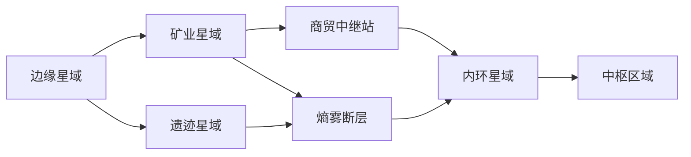

# 系统文档：星域地图与舰船航行（航网探索）

> 文档版本：v0.3  
> 文档类型：**规则（后 MVP 主形态）**；域内 M2 已落地，宇宙层为 M3+  
> **实现与验收状态**见 [PRODUCT-STATUS.md](PRODUCT-STATUS.md)；本文仅描述规则与设计标准。  
> 上级约束：`02-core-product-design.md`、`03-worldbuilding.md`  
> 关联：`13-region-and-ship.md`（区域战斗门）、`14-idle-and-offline.md`、`15-economy.md`、`16-market-and-card-trade.md`、`17-sector-and-onboarding.md`、`18-online-and-play-modes.md`、`21-fleet-factions-and-exploration.md`、**`23-procedural-universe-generation.md`（宇宙层生成管线）**  
> 更新日期：2026-08-30  
> 变更：v0.3 对齐程序生成航网（固定骨架 + 种子随机 + 验证器，见 `23`）；v0.2 拍板两层航网、五种通航状态、环带+网状路线。M2 域内雏形已按本文落地（见 §12.2）。

---

## 0. 核心规则（一句话）

> 宇宙由**星域节点**与**航线**连接构成。熵雾使大量节点失去定位、航线中断。玩家从**外缘星域**出发，通过扫描、战斗、生产、贸易和公共建设逐步**恢复航网**。越接近宇宙中心，熵雾、敌人、距离与补给压力越高，但资源、技术与断航情报也越珍贵。

**抵达中心是结果；让断裂的节点重新连接起来，才是持续发生的玩法。**

禁止把网状星图做成「换成蜘蛛网外观的线性关卡树」。

长期目标空间化：

> 玩家从宇宙边缘出生，在熵雾中逐渐恢复节点与航线；越接近中心，敌人、环境和物流压力越高，同时获得更稀有的资源与断航真相。

每个新星域的完整开拓循环：

```text
探测信号
→ 定位节点
→ 选择进入路线
→ 突破环境或敌人
→ 修复航标
→ 建立采集与补给
→ 稳定航线
→ 自动物流
→ 向更深层扩张
```

战斗、生产和探索必须**同时**参与开图。Region 开战硬门（前置通关 + 舰船门，见 `13`）仍然成立；本文管的是**如何看见、抵达、维持航道**。

---

## 1. 目标与非目标

### 1.1 目标

1. **两层网络**：宇宙层只连星域；星域层才连星球与地点。  
2. **熵雾是空间状态**，不是灰色锁图标。  
3. **路线有策略差**：军事 / 工业 / 商贸 / 裂隙可交汇，不锁死职业。  
4. **环带控制进度，网状提供横向**：推荐远征等级，允许越级但付代价。  
5. **航线是可升级资产**：从未知路径到自动物流。  
6. **虫洞是特殊边**，不是另一套地图系统。  
7. 保留 M1 已落地的「舰船有坐标、雷达揭示、巡航耗时」（见 §12）。

### 1.2 非目标

- 实时 3D 飞行、手操躲避  
- 开放世界同屏抢点 PvP（Online 仍用位面，见 `18`）  
- 用航行取消 Region 战斗门槛  
- MVP 一次做完全宇宙航网（第七前沿仍是外缘试点）  
- 把所有星球与所有星域画在同一张网上  

### 1.3 原则

| 原则 | 做法 |
| --- | --- |
| 开图 = 恢复航网 | 扫描→定位→通航→补给→自动物流 |
| 选择有意义 | 四条路线策略差；短路高风险 |
| 中心是远征检验 | 敌人+熵雾+距离+情报+资源五维，不是纯 HP |
| 后方仍有价值 | 软衰退（效率下降），不频繁锁回已通航线 |
| 可读 | 宇宙层只显示星域；默认隐藏低价值点；图层过滤 |

---

## 2. 两层网络

不要把所有星域和所有星球放在同一张网里。节点数量会失控，也无法阅读。

### 2.1 宇宙航网（星域之间）

每个**节点**是一整个星域；每条**边**是跨星域航道。



宇宙层承担：

- 长期进度与前往中心的**路线选择**；  
- 星域资源比较优势；  
- 玩家公共航线与跨星域贸易；  
- 虫洞、隐藏捷径。

### 2.2 星域星图（星球与地点之间）

进入星域后，再显示内部网络：恒星、行星、空间站、资源带、遗迹、熵雾异常、星域航标、跨星域出口。星域内部形成自己的小型非线性探索。

| 层级 | 节点 | 边 | 玩法权威 |
| --- | --- | --- | --- |
| 宇宙航网 | 星域 | 跨域航道 / 虫洞 | 本文 §2–§9 |
| 星域星图 | 天体 / 兴趣点 | 域内航道 | 雷达/巡航（§12）+ Region（`13`/`17`） |
| 地点内容 | Region | — | 战斗 / 采集 / 刷取 |

**与现 MVP：** 第七前沿 6 个 `regionId` 落在同一星域内部网上。线性前置可作「推荐航线」；物理上允许先扫到后区坐标，开战仍受 `13` 硬门限制。

---

## 3. 五种航网状态（「未解锁」≠ 上锁）

若熵雾区只是灰节点加一把锁，体验仍是「战力够了 → 点下一关」。熵雾必须是可调查、对抗和改变的空间状态。

| 状态 | 地图表现 | 玩家可以做什么 |
| --- | --- | --- |
| **未观测** | 完全隐藏 | 提升扫描、获取情报 |
| **熵雾覆盖** | 只显示模糊轮廓 | 探测信号、定位节点 |
| **已定位** | 显示节点与危险度 | 规划路线、派遣探针 |
| **临时通航** | 航道不稳定 | 冒险通过，承担额外成本 |
| **稳定通航** | 正常航线 | 自动航行、贸易和挂机 |

玩家不是「解锁一个星球」，而是在逐步恢复一段航网。

示例修复链：

1. 从边缘扫描到熵雾中的周期信号；  
2. 三角定位出未知航标；  
3. 派遣舰队清除附近敌人；  
4. 运输材料修复航标；  
5. 航标驱散局部熵雾；  
6. 显露后方多个节点和新路线；  
7. 建立长期补给线；  
8. 航线进入稳定通航。

Region 的 `Locked / Visible / Cleared` 描述**地点内容**；上表描述**航网上的可见性与通行**。两者同时成立：可以已定位某星球，但仍因舰船门打不开 Region。

---

## 4. 中心难度：五个维度

「越靠近中心越难」正确；若只加敌人攻击和生命，会迅速退化成战力门槛。

| 难度维度 | 边缘 | 中环 | 中枢附近 |
| --- | --- | --- | --- |
| **敌人** | 单一阵容 | 机制组合 | 多阶段及动态克制 |
| **熵雾** | 轻微干扰 | 持续侵蚀 | 改变航行规则 |
| **距离** | 补给容易 | 需要中继站 | 长期远征 |
| **情报** | 位置明确 | 存在假信号 | 坐标与历史可能冲突 |
| **资源** | 常规资源 | 专业化资源 | 稀有但高风险 |

靠近中心后，挑战是**远征能力检验**：

- 舰员阵容能否解决敌人；  
- 工业体系能否持续补给；  
- 舰船能否承受环境；  
- 贸易网络能否补齐稀缺材料；  
- 玩家能否建设并维持航线。

这让新手卡牌、中期生产、后期贸易在中心远征中汇合。卡关区（`21` §2）是五维中的陡升节点，不是唯一难度手段。

**推荐远征等级**（软门，非绝对禁止）：

> 内环航线建议远征等级 32。当前舰队可以尝试，但熵雾侵蚀 +65%，无法使用自动返航。

高手可越级；普通玩家知道该继续准备什么。

---

## 5. 路线必须有策略差

网状的意义不是连线多，而是每条路代表不同发展策略。从边缘前往内环，例如：

| 路线 | 体验 | 收益 | 代价 |
| --- | --- | --- | --- |
| **军事** | 战斗频繁，航线较稳 | 武器蓝图 | 阵容要求高 |
| **工业** | 矿产丰富，建设多 | 长期生产优势 | 推进慢 |
| **商贸** | 多中转站，战斗少 | 信用、阵营关系 | 依赖市场 |
| **裂隙** | 虫洞与不稳定航道 | 秘境、稀有资源 | 短距、高随机 |

路线可重新交汇。玩家不是选职业后永远锁死，而是在不同阶段切换。

防止最短路径成为唯一答案：

- 核心航线需要不同工业条件；  
- 横向探索产出关键模块和蓝图；  
- 越短的路线风险越高；  
- 某些航线周期性中断；  
- 远路可能更稳、资源更好。

---

## 6. 环带 + 网状连接

纯随机网易杂乱。用**宇宙环带**控制整体进度，环带内部提供非线性。

| 环带 | 定位 | 主要内容 |
| --- | --- | --- |
| **外缘带** | 新手 | 卡牌、基础战斗、首次修复航标 |
| **开拓带** | 初期 | 采集、第一条生产线、多路线选择 |
| **断航带** | 中期 | 星域专业化、熵雾环境、远征补给 |
| **位面带** | 中后期 | 玩家交易、位面资源差、公共工程 |
| **内环带** | 后期 | 大型协作、复杂敌人、动态航道 |
| **中枢区** | 终局 | 断航真相与航网最终选择 |

环带**不是**固定章节墙。玩家可在环带内横向探索，也可冒险提前进入下一层（付 §4 软门代价）。

**宇宙层节点布局：** 环带层级与中心/终局锚点为**固定规则**；星域坐标、邻接、势力与资源填充为**种子驱动随机**，须通过 `23-procedural-universe-generation.md` 验证器。环带在视觉上可呈熵雾扭曲的不规则区域，而非绝对同心圆。

MVP：第七前沿落在**外缘带**（手工模板，见 `17`）；M3+ 展开开拓带及以远，并试点 §23 小型随机航网。

---

## 7. 出生扇区

玩家出生在网的边缘合理；不同玩家不应出生在完全等价的复制图，也不能因随机出生永久吃亏。

每位玩家（Online 每位面）出生在不同的**边缘扇区**，拥有一种比较优势：

| 出生扇区 | 优势 | 缺口 |
| --- | --- | --- |
| **富矿边境** | 金属丰富 | 能源不足 |
| **晶潮边境** | 能源材料丰富 | 舰体材料不足 |
| **生物边境** | 药剂和纤维丰富 | 重工业效率低 |
| **遗迹边境** | 蓝图和档案丰富 | 基础资源较少 |

所有出生点必须保证：

1. 基础材料可以自给；  
2. 第一条完整生产链可以建立；  
3. 能独立进入第二环带；  
4. 至少有一项适合出口的优势资源；  
5. **不存在明显最优出生区。**

主线所需能力须能通过自给、绕行或交易获得，禁止随机出「劣等宇宙」。

**生成契约（M3+）：** 出生扇区与位面比较优势由 `UniverseSeed` 驱动（主/次优势 + 缺口），基础保障资源不得缺失；公式与验证见 `23-procedural-universe-generation.md` §5。

玩家在外缘独立发展；进入**位面带**后才真正感到：我擅长别人缺少的东西，别人也拥有我需要的资源。与 `18` 位面偏置、`03` §9 对齐。

**Solo / MVP：** 固定第七前沿（可叙事为「开拓局试验投放」的富矿或平衡扇区），不随机出生；M3 起第二个星域或宇宙层试点接 `23`。

---

## 8. 航线是资产

连接线不能只是视觉线。每条航线记录：

| 字段 | 含义 |
| --- | --- |
| 稳定度 | 对应临时 / 稳定通航 |
| 航行时间 | 受距离、熵雾、中继影响 |
| 燃料消耗 | 巡航 / 跃迁成本 |
| 熵雾浓度 | 偏航、耐久、规则干扰 |
| 敌对活动 | 遭遇权重 |
| 运输容量 | 物流上限 |
| 中继站 | 是否可自动补给 |
| 自动运输 | 是否进入物流档 |
| 当前维护者 | 玩家 / 公会 / NPC |

升级链：

```text
未知路径
→ 临时航线
→ 稳定航线
→ 补给航线
→ 自动物流航线
→ 跨位面航线
```

建设反馈：原本一次危险远征，可以变成能自动运资源的成熟航道。自动化不只发生在工厂内部，而扩展到宇宙物流（与 `15` 流水线衔接，后 MVP）。

### 8.1 后方必须持续有价值

防止玩家只向中心冲、不经营已探索区：

- 后方提供稳定基础资源；  
- 设施和中继需要合理维护；  
- 新航线依赖旧航线补给；  
- NPC / 玩家订单改变区域需求；  
- 熵雾可**软衰退**未维护航道（降低运输效率），**禁止**频繁重新锁图。

---

## 9. 虫洞 = 航网中的特殊边

不单开一套虫洞地图。发现虫洞 = 星图上出现一条新边，直接改写原有路线。

| 虫洞类型 | 网络作用 |
| --- | --- |
| **稳定虫洞** | 连接两个遥远节点 |
| **单向虫洞** | 快速深入，无法原路返回 |
| **潮汐虫洞** | 周期性出现 |
| **漂移虫洞** | 出口在多个节点间变化 |
| **位面虫洞** | 连接其他玩家宇宙（Online） |
| **秘境裂隙** | 连接临时副本节点 |

战略选择（Online / 后 MVP）：公开坐标、卖给商盟、公会稳定并控制、保密自用、摧毁以阻止污染外溢。

与 `13` §10.1「虫洞随机跃迁」对齐：**失败回到跃迁原点**仍可作为单向/漂移虫洞的结算；发现本身应改变星图边，而不是只开宝箱。

探索度 >100% 事件池（`21` §6.3）是**发现**虫洞边的来源之一。

---

## 10. 节点数量与图层

每个节点都可点会迅速变成噪声。

- 宇宙层**只显示星域**；  
- 星域层才显示行星和兴趣点；  
- 默认隐藏低价值节点；  
- 提供资源 / 任务 / 危险 / 贸易图层；  
- 使用节点聚类与缩放层级。

部分星域可在不同玩家位面中偏移（丰度、某条航线被熵雾盖住、虫洞出口、遗迹保存度、事件），但须遵守 §7 的「无劣等宇宙」。偏移由 **UniverseSeed + 验证器** 保证可玩性，详见 `23` §1、§10。

---

## 11. 与 Region / 探索度的关系

```text
宇宙层选星域（航网状态 ≥ 已定位）
  → 进入星域星图
  → 巡航/跃迁抵达 body
  → 打开 Region 列表
  → CanEnter 仍用 13：前置 + 舰船门
```

**找路与维持航道**靠本文；**开打**靠战力与舰船建设。

星域探索度（`21` §6）表示对该星域内部世界的熟悉度，**提高**候选天体权重，**不替代**五种航网状态。建议对应：

| 探索度（域内） | 航网侧效果（建议） |
| --- | --- |
| 低 | 多为熵雾覆盖 / 已定位 |
| 50% | 主星与阵营商店；利于把域内干线推到临时通航 |
| 100% | Boss 入口；利于稳定通航 |
| >100% | 虫洞边、秘境裂隙事件 |

---

## 12. 当前实现（M1 保留 + M2 域内航网雏形）

宇宙航网（星域之间）仍为 **M3+**。第七前沿只做**星域内部**网。实现状态见 PRODUCT-STATUS。

### 12.1 M1 仍有效

| 项 | 规则 |
| --- | --- |
| 舰船坐标 | `navX/navY`；存档权威 |
| 雷达 | `radarRange` 由扫描模块推导；**移动才把未观测点刷成熵雾覆盖** |
| 巡航 Cruise | 域内移动；耗时随航道熵雾 / 临时通航 / 远征等级软门放大 |
| 跃迁 Jump | **M3**；不做跨域 |

### 12.2 M2 已落地（域内）

| 项 | 规则 |
| --- | --- |
| 五种状态 | 未观测/未解锁在地图上显示熵雾轮廓；已定位可规划航行；临时通航额外代价；稳定通航由修复航标或通关写入 |
| 内网边 | 军事 / 工业 / 商贸 / 裂隙四类航道，可交汇，不是线性关卡树 |
| 探测 | 雷达范围内或从已定位邻接边探测：熵雾覆盖 → 已定位 |
| 海图 | 停靠外缘港花费信用购买；揭示未观测为熵雾轮廓；主星（边境锚点）在探索度 50% 前不可被海图揭示 |
| 航标 | 停靠后可花费废料+信用修复；区域首通自动稳定该节点及相邻已定位边 |
| 软门 | 舰船等级低于推荐远征等级时，航行代价上升且提示无法自动返航（不禁止进入） |
| 探索度 | `explorationProgress` = 区域通关与航网恢复的加权；写入 `world.json` + 玩家档 |
| 缩放两层 | 连续平滑缩放+拖拽平移（类地图）；星域内缩小过临界点进入宇宙层，宇宙层只能点「进入星域」回到星域内。仅绘制已解锁节点及其相邻节点 |

### 12.2.1 P6 星图 UI（见 [22](22-ux-loop-and-ia.md)）

| 项 | 规则 |
| --- | --- |
| 布局 | 星图主体 **≥70%** 宽；节点列表收成可折叠导航日志；右侧仅目标面板 |
| 四轴展示 | 发现 / 航线 / 开发 / 舰队 — 组合文案，禁止混在一句话 |
| 节点视觉 | 未探测/熵雾用剪影或雾效，非完整行星立绘 |
| 图例 | 航线颜色图例（军事/工业/商贸/裂隙 + 通航 tier） |
| CTA | 按状态只显示合理操作；「购买星域海图」在扫描/情报区 |

雷达 / 海图公式（M2）：

```text
Unobserved → Fogged   if distance(ship, body) <= radarRange
                       OR (chart owned AND not capital-hub-before-50%)
Fogged     → Located  if Probe (in radar or located neighbor)
Located+   → sail allowed
dock / first sail     → Provisional node + incident edge
Repair beacon / clear → Stable
```

`knownBodyIds` 与 **已定位及以上** 同步，供旧逻辑读取。

### 12.3 航行时间与反时间墙

继承 `14`：航行写入 `TransitAction`；离线计入 credited 时间；允许材料/信用加速短途；禁止纯时间墙。航行中已启动的采集/制造可继续。M2 巡航仍为即时抵达 + ETA 展示（与 M1 相同）；乘数只影响显示与软门文案。

### 12.4 信标跃迁（M3）

跨星域阀门。标准跃迁消耗信标；盲跃高风险。经济上避免瞬间跳到中心高危带。与「临时通航承担额外成本」兼容。

---

## 13. 分阶段落地

| 阶段 | 交付 | 说明 |
| --- | --- | --- |
| **现况** | Region 战斗门 `13` | 开战硬门不变 |
| **M1** | 单星域 2D + 雷达 + 巡航 + 已探索列表 | 已实现（见 STATUS） |
| **M2** | 海图/中枢 + 域内航网状态雏形 | **部分实现**：五种状态 + 缩放两层 + 邻接解锁 + 探测/航标/海图；其他星域不可进入 |
| **M3** | 第二星域可玩 + 信标跃迁 + **小型随机航网试点** | 外缘→开拓带；15–20 星域 / 4 环带；见 `23` §12 |
| **M4** | 环带径向 + 航线升级 + 虫洞边 + **生成验证器** | 长线探索；推荐远征等级；局部修复坏图 |
| **M5+** | 完整宇宙生成 + 出生扇区 seed + 跨位面航线 | 依赖 Online `18`；秘境槽位动态激活 |

MVP 演示不阻塞于 M3+；语义以本文为准。

---

## 14. 数据模型（草案）

```text
UniverseConfig
- center, rings[]          // 环带（固定层级；节点坐标见 23）
- threatBands[]            // 五维基线，非仅等级
- universeSeed             // Hash(服务器+位面+赛季)；见 23 §2.1、06 §4.3.7

GridNode                  // 宇宙层：星域
- sectorId, ringId
- gridState                // 五种航网状态
- recommendedExpeditionLv

GridEdge                  // 宇宙层：航道 / 虫洞
- from, to
- edgeType: Lane|Wormhole…
- stability, transitTime, fuel, entropy, hostility
- capacity, hasRelay, autoLogistics
- maintainerId
- upgradeTier              // 未知→…→跨位面

SectorMap                 // 星域层
- bodies[], innerEdges[]
- hubBodyId, chartItemId

StellarBody
- bodyId, sectorId, x, y
- regionIds[]
- bodyType: Planet|Station|Belt|Relic|Beacon|Exit|Anomaly|Hub

ShipNavigationState       // M1 已部分落地
- x, y, radarRange
- unlockedCharts[], knownBodyIds[]
- transit?

BirthSector               // Online；Solo 固定第七前沿
- sectorAffinityId
- exportBias, importGap
```

服务方向：`NavigationService`（巡航）+ `GridService`（节点状态、边升级、海图、探测）。宇宙层 `GridService` 扩展为 M3；**生成**见 `UniverseGenerator`（`23` §11）。

---

## 15. UI

| 屏 | 内容 |
| --- | --- |
| 宇宙航网 | 星域节点、航道稳定度、环带、推荐远征等级；默认不画星球 |
| 星域星图 | 雷达圈、舰船、航标、出口、图层开关 |
| 航行 / 跃迁 | 时间、燃料、熵雾风险、是否可自动返航 |
| 航线面板 | 升级档位、维护、物流开关 |
| 地点点开 | 转入 Region 挑战 / 采集 |

---

## 16. 设计验收标准

- 玩家理解目标是**编织航网**，不是点下一关打到中心。  
- 宇宙层与星域层分离，不会在一张图上堆满星球。  
- 熵雾区可以探测与改变，而不是一把锁。  
- 至少能讲清四条策略路线的差异，且可交汇。  
- 越级走软门（侵蚀、禁自动返航），不绝对锁死。  
- 航线升级能把「危险远征」变成「自动物流」。  
- 后方软衰退，不频繁锁图。  
- M1：把船开过去；雷达决定看见什么。
- M2：熵雾可探测；航线可修复；海图不代替航行。

---

## 17. 开放问题

1. 驾驶是否占用一支卡组，或仅锁舰船？  
2. 盲跃 / 临时通航的偏航与额外成本公式？  
3. 海图永久解锁 vs 消耗品？（建议永久）  
4. Solo 是否在 M4 前暴露宇宙层，还是仅用星域内网模拟五种状态？  
5. 航线维护者在 Solo 是否仅为玩家 + NPC 开拓局？  

---

## 18. 参考

- `03-worldbuilding.md`（断航 / 熵雾 / 中枢选择）  
- `13-region-and-ship.md`、`17-sector-and-onboarding.md`  
- `14-idle-and-offline.md`、`15-economy.md`、`16-market-and-card-trade.md`  
- `18-online-and-play-modes.md`、`21-fleet-factions-and-exploration.md`  
- **`23-procedural-universe-generation.md`**（种子生成、验证器、位面比较优势）  
- 舰船模块：`mod_scanner` / `mod_propulsion` / `mod_reactor` / `mod_entropy`
