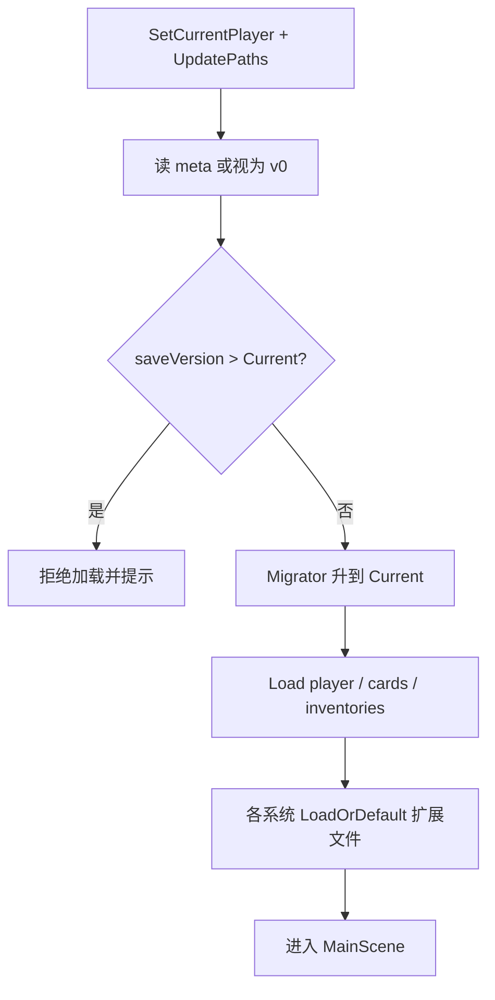

# 系统文档：存档契约与种子数据

> 文档版本：v1.0  
> 状态：**MVP 规则已拍板，可供 P0 实现**  
> 上级约束：`Documentation/01-core-product-design.md` §16.1 / §20 / §22；开发计划 P0.1 / P0.2  
> 分工：路径与 JsonUtility 现状见 [../05-data-and-save.md](../05-data-and-save.md)；**本文件定契约**（版本、迁移、FakeData 边界、分文件、原子写、新档种子）  
> 实现阶段：开发计划 P0（见 `../11-mvp-development-plan.md`）  
> 更新日期：2026-08-09

---

## 1. 目标与非目标

### 1.1 目标

在扩展卡组 / 区域 / 经济 / 市场之前，先把存档变成**可安全迭代的契约**：

1. **正式流程不再被 FakeData 污染**（启动不随机覆写玩家仓库、材料、敌人等）；  
2. **存档有版本号与迁移路径**，旧档可读或明确失败；  
3. **本地背包与远程背包分文件**，互不覆盖；  
4. **写入原子化**，崩溃不留下半截 JSON；  
5. **新档有确定的启动种子**（可配置、可重复），与开发用模拟数据分离；  
6. 为后续 `decks.json` / `world.json` / `ship.json` / `idle.json` / `market_local.json` 预留统一入口。

完成本契约后，里程碑 **M0（可迭代原型）** 的存档侧条件满足。

### 1.2 非目标

- 资源品类表、货舱容量数值 → `09-resources-and-warehouse.md`  
- 卡组 / 占用 / 区域 / 离线 / 生产 / 市场的玩法语义 → `01`–`07`（本文件只规定它们**如何落盘**）  
- 真加密、防作弊、云同步冲突解决（Base64 仍不是安全边界）  
- 多端同时写同一存档目录的并发锁（单机单实例假设）  
- Addressables 内容管线本身 → `11-faction-and-content-pipeline.md`

---

## 2. 术语

| 术语 | 定义 |
| --- | --- |
| **存档根（Save Root）** | `Application.persistentDataPath/saves/` |
| **玩家档目录** | `saves/{playerId}/` |
| **存档版本（saveVersion）** | 整数；表示玩家档目录所遵循的 schema 代数；写入 `meta.json` |
| **迁移器（Migrator）** | 将 `saveVersion = N` 的目录升级到 `N+1` 的纯数据变换 |
| **正式模式（Production Mode）** | 默认运行模式；禁止向玩家档写入随机原型数据 |
| **开发数据模式（Dev Data Mode）** | 仅 Editor / 显式开关开启；允许注入模拟数据，且**默认写入隔离目录或内存** |
| **静态配置（Static Config）** | `Resources/data` 等只读内容（技能、属性、遭遇表）；不是玩家档 |
| **启动种子（Starter Seed）** | 创建新角色时写入的确定初始物品/卡牌/舰船等；来自配置表，非 `Random` |
| **污染（Pollution）** | 启动或刷新时用随机/占位数据覆盖玩家已有存档的行为 |
| **原子写（Atomic Write）** | 先写临时文件，校验后再 `replace` 目标文件 |

---

## 3. 硬约束（不可违背）

1. **正式模式禁止 FakeData 写玩家档**。任何 `FakeData()` / `CreateFakeData()` 不得在正式流程调用 `DataUtil.Save*`。  
2. **读档优先于造数**：若目标存档文件已存在，正式模式只加载，不重新随机生成。  
3. **双背包分文件**：本地与远程物品集合不得共用同一 JSON 文件。  
4. **每次成功保存后 `meta.json` 的 `saveVersion` 必须等于当前代码支持的版本**。  
5. **迁移单向**：只允许 `N → N+1 → … → Current`；失败则拒绝加载并提示备份路径，不得静默丢字段当成功。  
6. **Base64 编码不是加密**；不得假设其可保护密钥或防篡改。  
7. **路径一律 `Path.Combine` / `DataUtil` API**；禁止手写 `/` 拼接。  
8. 后续玩法模块新增玩家持久状态时，必须：登记文件名、纳入 `saveVersion`、提供 Migrator 或「缺文件则默认初始化」策略。

---

## 4. MVP 拍板决议

> 下列决议关闭开发计划 P0.1 / P0.2 与已知问题中的存档技术债。语义按本表实现；开关名可微调。

### 4.1 运行模式与 FakeData 边界

| 项目 | MVP 规则 |
| --- | --- |
| 默认模式 | **正式模式**（含 Development Build 与 Release） |
| Dev Data Mode 开启条件 | **仅** `UNITY_EDITOR` 且 `DevDataSettings.enabled == true`，**或** 启动参数 / Debug 菜单显式打开 |
| PlayerPrefs / 打包包体 | 正式包默认 `enabled = false`；不得因 `DefaultProperty.isDebug`（明文 JSON）连带打开 FakeData |
| 正式模式遇「需要演示数据」 | 使用 **Starter Seed 配置表** 或遭遇/静态配置；禁止 `Random.Range` 写档 |
| Dev 注入目标 | 优先写入 `saves/_dev/{playerId}/` **或** 仅内存；若必须写正式档目录，须二次确认且打日志 `[DEV-DATA]` |
| 战斗敌人 | 正式流程只读 `EncounterConfig`；`BattleController.FakeData()` 仅 Dev 或单测夹具 |
| 抽卡材料 / 雷达星球 / 事件 | 正式流程读静态表或空列表；现有 `FakeData()` 迁入 `IDevDataProvider` |

#### 4.1.1 `IDevDataProvider` 契约

```text
IDevDataProvider
- bool IsActive { get; }
- IReadOnlyList<ItemEntity> CreateSampleInventory(bool isRemote)
- IReadOnlyList<CardEntity> CreateSampleEnemyParty(int count)
- IReadOnlyList<ItemEntity> CreateSampleGachaMaterials()
- PlanetEntity CreateSamplePlanet()
- // 可扩展；禁止在实现内直接 SaveItemData
```

规则：

- 业务代码通过注入或 `DevData.Current` 访问；`IsActive == false` 时所有方法应抛出或返回空，并由调用方走正式分支。  
- **禁止**在 `InventoryItemManagerBase.Start` 无条件 `CreateFakeData()`。改为：`Load` → 若空且是新档则 `ApplyStarterSeed` → 仅当 Dev 且用户选择「注入样例」才调用 Provider。

### 4.2 新档启动种子（Starter Seed）

| 项目 | MVP 默认 |
| --- | --- |
| 触发时机 | `CreatePlayerData()` 成功并完成目录绑定之后，一次性写入 |
| 幂等 | 仅当对应文件不存在或集合为空时写入；**不得**在每次 `Start` 重复写入 |
| 确定性 | 同一 `StarterSeedTable` 版本 → 同一初始集合（无随机） |
| 初始本地背包 | 少量教程材料（具体 ID 见未来 `09`；P0 可用占位 `seed_scrap` × 20 等配置行） |
| 初始远程背包 | **空**（或仅飞船货舱标记物品，按 `09` 定） |
| 初始卡牌 | 保持现有创角/教程发卡流程；本文件不强制改卡池，但禁止用随机 Fake 卡覆盖 `playerCards.json` |
| 初始舰船 / 世界 / 卡组 | 文件缺失时由各系统「缺省初始化」写入（见 §5.3）；P0 可只建 `meta.json` + 现有三文件 |

配置建议：`Resources/data/StarterSeed.json`（或 ScriptableObject），含 `seedTableVersion`。

### 4.3 `saveVersion` 与 `meta.json`

每个玩家档目录必须有：

```text
saves/{playerId}/meta.json
- saveVersion: int          // 当前 schema
- createdAtUtc: long
- lastSavedAtUtc: long
- starterSeedTableVersion: int
- appVersion: string        // Application.version，仅诊断
```

| 项目 | MVP 默认 |
| --- | --- |
| 当前代码版本 `CurrentSaveVersion` | **1**（完成本契约后的第一版） |
| 无 `meta.json` 的旧档 | 视为 `saveVersion = 0`，启动时跑迁移到 1 |
| 高于 Current | **拒绝加载**，提示「请更新游戏」；不降级写回 |
| 迁移失败 | 拒绝进入游戏；保留原文件；可选复制到 `saves/_corrupt/{playerId}_{timestamp}/` |

#### 4.3.1 版本 0 → 1 迁移（必做）

| 步骤 | 动作 |
| --- | --- |
| 1 | 若存在唯一 `itemData.json`：按 `ItemEntity.isRemote` **拆分**为 `inventory_local.json` 与 `inventory_remote.json`；然后将 `itemData.json` 重命名为 `itemData.json.bak`（保留一个版本周期） |
| 2 | 若拆分后某侧为空列表，保留空文件（合法） |
| 3 | 写入 `meta.json`（`saveVersion = 1`） |
| 4 | 不删除玩家卡牌/角色数据 |

`saveVersion ≥ 2` 起的迁移由后续玩法文档登记（例如引入 `decks.json` 时写 1→2）。

### 4.4 物品分文件

| 集合 | 文件名 | 读写方 |
| --- | --- | --- |
| 本地仓库 | `inventory_local.json` | `ItemManager` / 本地库存服务 |
| 远程（舰船等）仓库 | `inventory_remote.json` | `RemoteItemManager` / 远程库存服务 |
| 旧文件 | `itemData.json` | **仅迁移器读取**；正式 API 删除 `SaveItemData` 无参歧义接口或标记 Obsolete |

API 拍板：

```text
DataUtil.SaveInventory(InventoryStore store, List<ItemEntity> items)
DataUtil.LoadInventory(InventoryStore store) -> List<ItemEntity>

enum InventoryStore { Local, Remote }
```

`SaveGameData()` 在 P0 至少应：玩家资料 + 卡牌 + **两侧库存**（若已加载）+ 刷新 `meta.json` 时间戳。

### 4.5 原子写

所有玩家档 JSON（含 `meta.json`）统一：

1. 序列化到内存字符串（再按 `isDebug` 决定是否 Base64）；  
2. 写入同目录 `.{fileName}.tmp`（例：`.inventory_local.json.tmp`）；  
3. `File.Replace` / 先删后移的平台安全封装，替换目标文件；  
4. 删除残留 tmp（若 Replace 已处理则跳过）。

失败时：保留旧目标文件；打 Error 日志；向上返回失败，UI 提示「保存失败」。

### 4.6 明文 vs Base64

| 项目 | 规则 |
| --- | --- |
| `DefaultProperty.isDebug == true` | 明文 JSON（便于查档） |
| `false` | Base64 文本存储（**混淆而非加密**） |
| 迁移 | 读写层统一走现有 `EncryptBase64` / `DecryptBase64`；Migrator 使用同一 API |

### 4.7 损坏与备份

| 情况 | MVP 行为 |
| --- | --- |
| JSON 解析失败 | 加载失败；尝试读取同名 `.bak`（若迁移留下）；仍失败则提示 |
| 写入中断电 | 原子写保证旧文件完整；下次正常加载旧档 |
| 玩家主动「重置存档」 | Debug/设置菜单；需确认；删除玩家目录或重建 |

P0 不强制每次保存都做滚动备份；迁移拆分时保留 `.bak` 即可。

---

## 5. 数据模型与目录契约

### 5.1 目标目录树（`saveVersion = 1`）

```text
Application.persistentDataPath/
└─ saves/
   ├─ playerEntities.json          // 或继续由子目录扫描生成列表
   ├─ _dev/                        // 仅 Dev Data Mode 可选隔离根
   ├─ _corrupt/                    // 迁移/损坏隔离
   └─ <player-guid>/
      ├─ meta.json                 // 必有（迁移后）
      ├─ playerData.json
      ├─ playerCards.json
      ├─ inventory_local.json      // 替代 itemData.json
      ├─ inventory_remote.json
      ├─ expertData.json
      ├─ avatar.png
      ├─ itemData.json.bak         // 仅 0→1 迁移残留，可随后清理
      │
      │  // 下列由后续阶段创建；缺省=该系统首次需要时初始化
      ├─ decks.json                // P1，见 01
      ├─ world.json                // P2，见 03
      ├─ ship.json                 // P2，见 03
      ├─ idle.json                 // P2/P3，见 04
      └─ market_local.json         // P4 LocalMock，见 07
```

### 5.2 Wrapper 约定

继续使用 `JsonUtility` + Wrapper（顶层 List 不可直接序列化）。新增文件同样遵循：

- 持久化用**字段**而非自动属性；  
- 运行时字典 / 事件不进档，加载后重建；  
- 枚举以整数序列化；变更枚举序必须走 Migrator。

建议为物品两侧使用同一 `ItemListWrapper`，或显式：

```text
InventoryFile
- items: List<ItemEntity>
- count: int
```

### 5.3 缺文件初始化策略

| 文件 | 缺失时 |
| --- | --- |
| `meta.json` | 视为 v0，迁移 |
| `playerData.json` / `playerCards.json` | 按现有创角流程；禁止 Fake 覆盖 |
| `inventory_*.json` | 空列表；若是**刚刚 CreatePlayer** 则 Apply Starter Seed（仅 Local） |
| `decks.json` 等未来文件 | 由对应系统文档的「缺省初始化 / 迁移」负责；存档层提供 `LoadOrDefault` |

### 5.4 与静态配置的边界

| 类型 | 位置 | 可变性 |
| --- | --- | --- |
| 技能、基础属性、遭遇、配方、种子表 | `Resources/data` / SO | 随包更新；不进玩家档 |
| 玩家拥有量、进度、订单、耐久实例 | `saves/{playerId}/` | 随游玩变化 |

正式战斗敌人、雷达演示星球等**不得**因「静态表暂缺」而回退到写玩家档的 FakeData；应显示「内容未配置」或使用只读 Dev Provider（不存档）。

---

## 6. 加载 / 保存时序

### 6.1 选档进入主流程



### 6.2 保存检查点

| 触发 | 最小写入集 |
| --- | --- |
| 设置菜单「保存」 | `SaveGameData` 全量：player、cards、local、remote、meta |
| 库存变更 | 对应 `inventory_*.json` + `meta.lastSavedAtUtc` |
| 场景切换（可选） | 与现有策略对齐；P0 至少保证设置保存与库存保存可靠 |
| 创角完成 | meta + player + 空/种子库存 +（既有）卡牌 |

---

## 7. 与现有代码的差距（实现映射）

| 现状 | 目标 |
| --- | --- |
| `InventoryItemManagerBase.Start` → `CreateFakeData` → `SaveItemData` | 删除无条件写档；改为 Load + StarterSeed / DevProvider |
| `ItemManager` 与 `RemoteItemManager` 共用 `itemData.json` | `inventory_local.json` / `inventory_remote.json` |
| `DataUtil.SaveData` 直接 `WriteAllText` | 原子写封装 `SaveDataAtomic` |
| 无版本号 | `meta.json` + `CurrentSaveVersion = 1` + Migrator 0→1 |
| `BattleController.FakeData` 等 | 正式路径改遭遇表；Fake 迁入 `IDevDataProvider` |
| `DefaultProperty.isDebug` 控制 Base64 | **继续只控制编码**；不控制 FakeData |
| `05-data-and-save.md` 仍写 `itemData.json` | 实现后更新 05 路径树，并指向本文 |

入口类（P0 优先改）：

- `Assets/Resources/Scripts/Utils/DataUtil.cs`  
- `Assets/Resources/Scripts/Inventory/InventoryItemManagerBase.cs`  
- `Assets/Resources/Scripts/Inventory/ItemManager.cs` / `RemoteItemManager.cs`  
- `Assets/Resources/Scripts/Props/DefaultProperty.cs`（新增文件名常量；勿把 Fake 绑到 `isDebug`）  
- 新建建议：`Utils/Save/SaveMigrator.cs`、`Utils/Save/DevDataSettings.cs`、`Utils/Save/IDevDataProvider.cs`

---

## 8. 分步实现顺序（对齐 P0）

1. **P0.1a** `DevDataSettings` + `IDevDataProvider`；切断库存 Fake 写档  
2. **P0.1b** 战斗/抽卡/雷达/事件 Fake 调用改为 Provider 守卫（可同 PR 或紧随）  
3. **P0.2a** `meta.json` + `CurrentSaveVersion` + 原子写  
4. **P0.2b** 库存分文件 API + 迁移 0→1  
5. **P0.2c** `StarterSeed` 新档写入；EditMode：迁移拆分、原子写崩溃模拟、正式模式不写随机档  
6. 更新 [../05-data-and-save.md](../05-data-and-save.md) 路径树与 [../08-known-issues.md](../08-known-issues.md) 对应条目状态  

> 开发计划 §10 将 P0.1 置于 P0.2 之前：先停污染，再改 schema，避免迁移测到随机垃圾数据。

---

## 9. 验收清单

- [ ] 正式模式启动 MainScene：**不会**因库存逻辑把随机物品写入玩家档  
- [ ] 连续两次启动，本地/远程库存与上次保存一致（无随机漂移）  
- [ ] 旧档仅有 `itemData.json` 时可自动迁移为 local/remote，并生成 `meta.json`（`saveVersion = 1`）  
- [ ] 迁移后改本地物品不影响远程文件，反之亦然  
- [ ] 保存过程杀进程（或单测模拟失败）不损坏旧 JSON  
- [ ] `saveVersion` 高于游戏支持时拒绝加载并提示  
- [ ] Editor 打开 Dev Data Mode 可注入样例；默认关闭时与正式包行为一致  
- [ ] 新档本地库存来自 Starter Seed 配置，而非 `Random`  
- [ ] `DefaultProperty.isDebug` 只影响明文/Base64，不打开 FakeData  
- [ ] EditMode：0→1 拆分、`isRemote` 归类、空档 LoadOrDefault  

---

## 10. 开放钩子

- 滚动备份（`backups/slot_N`）与云同步  
- 存档校验和（防轻度篡改提示，非安全）  
- 多玩家档导入/导出  
- `saves/_dev` 一键清空  
- 将 `playerEntities.json` 与目录扫描彻底统一为单一真相源  
- `SaveGameData` 扩展为注册表模式（各系统 `ISaveParticipant`）以免遗漏新文件  

若产品改为「允许正式包内一键填充演示档」，须仍走 Starter Seed / 显式「演示档案」模板，**不得**复活启动时 FakeData 覆写。

---

## 11. 参考

- 路径现状：`Documentation/zh-CN/05-data-and-save.md`  
- 技术债：`Documentation/zh-CN/08-known-issues.md`  
- 开发计划：`Documentation/zh-CN/11-mvp-development-plan.md` P0.1 / P0.2 / §7.2  
- 卡组落盘：`01-deck-and-occupation.md`（`decks.json`）  
- 区域/舰船：`03-region-and-ship.md`（`world.json` / `ship.json`）  
- 离线：`04-idle-and-offline.md`（`idle.json`）  
- 市场 Mock：`07-market-and-card-trade.md`（`market_local.json`）  
- 代码：`DataUtil.cs`、`InventoryItemManagerBase.cs`、`DefaultProperty.cs`、`BattleController.cs`
