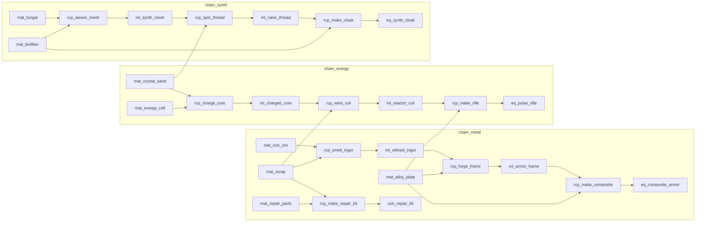

# 系统文档：资源表、生产链与仓库

> 文档版本：v1.0  
> 状态：**P3 内容契约（MVP）**  
> 上级约束：`Documentation/01-core-product-design.md` §7.9 / §16.1 / §20 / §22  
> 关联：`05-production-and-quality.md`（规则与公式）、`03-region-and-ship.md`（舰船模块）、`04-idle-and-offline.md`（满仓 / Pending）、`06-durability-and-repair.md`（维修耗材）、`08-save-and-seed-data.md`（种子物资）  
> 实现权威：`ItemCatalog` / `RecipeCatalog` / `GatherNodeCatalog` / `ShipModuleCatalog` / `QualityRules` / `ProductionService`  
> 更新日期：2026-08-10

---

## 1. 目标与非目标

### 1.1 目标

为本文件锁定 **MVP 可玩资源内容契约**：具体有哪些 Resource、Recipe、Chain、Facility，以及工坊/模块等级如何解锁与加成。  
规则语义（扣料时机、品质公式形状、停止不退料等）以 `05-production-and-quality.md` 为准；**本文件给可配置内容的默认表**。

覆盖范围：

| 主题 | 本文件职责 |
| --- | --- |
| **资源（Resource）** | 18 种可堆叠物 + 12 种装备/模块定义清单 |
| **配方（Recipe）** | 全量表：输入 / 产出 / 工时 / 设施门槛 |
| **生产链（Chain）** | 3 条完整链的路径与验收 |
| **加工（Process）** | 材料→中间件配方集合 |
| **制造（Manufacture）** | 中间件→成品配方集合 |
| **品质（Quality）** | 内容侧默认与采集品质约定 |
| **设施（Facility）** | 生产挂钩的舰船工坊/模块 |
| **模块等级** | 解锁配方、速度与品质加成曲线 |

### 1.2 非目标

- 品质 score 公式细节、保底/拆解语义 → `05`
- 离线时钟与 `PausedBlock` → `04`
- 区域硬门与非生产舰船模块成长 → `03`
- 耐久损耗公式 → `06`
- NPC 定价完整表 → `07`（本文件只给 `baseCost` 基准）
- 卡牌制造第四链、公会订单（非 MVP）

---

## 2. 术语（与 05 对齐）

| 术语 | 定义 | MVP 权威 Id |
| --- | --- | --- |
| **资源（Resource）** | 可堆叠材料 / 中间件 / 消耗品；堆叠键 `(itemDefId, quality)` | `itemDefId` |
| **装备 / 舰船模块物品** | 不可堆叠实例；含品质与耐久 | `itemInstanceId` + `itemDefId` |
| **配方（Recipe）** | 输入、产出、周期、设施要求 | `recipeId` |
| **生产链（Chain）** | ≥2 步串联的配方族 | `chainId` |
| **加工（Process）** | `RecipeKind.Process`：材料→材料 | `DeckActionType.Process` |
| **制造（Manufacture）** | `RecipeKind.Manufacture`：产出装备/模块/高阶消耗品 | `DeckActionType.Manufacture` |
| **品质（Quality）** | `Q1`…`Q5` 离散档 | `QualityTier` |
| **设施（Facility）** | 生产挂钩的**舰船模块**；提供解锁 / 速度 / 品质 | `facilityModuleId` ≡ `ShipModule.moduleId` |
| **仓库（Warehouse）** | 本地背包格位；满则 `PausedBlock` + Pending | 容量默认 **60** |

> 设计文档中的「装甲工坊 / 能源车间 / 合成舱」一律映射为舰船模块 Id，不另建 Facility 实体。

---

## 3. 硬约束

1. MVP 至少 **18** 种可堆叠资源、**12** 种装备/模块定义、**3** 条完整链。  
2. 每条链至少：原料来源（采集或战斗掉落）→ **Process** → **Manufacture** 成品。  
3. 配方必须声明 `facilityModuleId`；启动时校验 **模块等级 ≥ requiredLevel**。  
4. 同定义不同品质**不可**合并堆叠。  
5. 仓库满：不丢已产出；行动 `PausedBlock`；可进 Pending。  
6. 首发循环可单人完成，不依赖公会订单或玩家市场。

---

## 4. 资源（Resource）

### 4.1 规模与分类

| 大类 `ItemCategory` | 数量 | 堆叠 | 说明 |
| --- | --- | --- | --- |
| `Material` | 8 | 是（999） | 原料与基础板材/芯/零件 |
| `Intermediate` | 6 | 是（999） | 加工产物 |
| `Consumable` | 4 | 是（99） | 维修包等 |
| `Equipment` | 8 | 否 | 武器 / 护甲 / 配件 / 工具 |
| `ShipModule`（物品） | 4 | 否 | 可制造的模块组件（入库实例） |
| **合计** | **30** | — | 其中可堆叠 **18**，装备/模块 **12** |

### 4.2 材料 `Material`（8）

| itemDefId | 中文 | 英文 | 图标提示 | baseCost (Q2) | 主要来源 |
| --- | --- | --- | --- | ---: | --- |
| `mat_scrap` | 废料 | Scrap | Steel | 0 | 战斗掉落 / 拆解 / 种子 |
| `mat_iron_ore` | 铁矿 | Iron Ore | Steel | 2 | 采集 `node_outer_iron` |
| `mat_crystal_sand` | 晶砂 | Crystal Sand | Crystal | 3 | 采集 `node_spur_crystal` |
| `mat_fungal` | 菌毯 | Fungal Mat | Organic | 2 | 采集 `node_spur_fungal` |
| `mat_alloy_plate` | 合金板 | Alloy Plate | Steel | 8 | 战斗掉落 / NPC / 种子 |
| `mat_energy_cell` | 能量芯 | Energy Cell | Crystal | 10 | 战斗掉落 / NPC |
| `mat_biofiber` | 生物纤维 | Biofiber | Organic | 6 | 战斗掉落 / NPC |
| `mat_repair_parts` | 维修零件 | Repair Parts | Steel | 5 | 战斗掉落 / 维修循环副产钩子 |

### 4.3 中间件 `Intermediate`（6）

| itemDefId | 中文 | 英文 | baseCost | 产出配方 |
| --- | --- | --- | ---: | --- |
| `int_refined_ingot` | 精炼锭 | Refined Ingot | 12 | `rcp_smelt_ingot` |
| `int_armor_frame` | 装甲框架 | Armor Frame | 20 | `rcp_forge_frame` |
| `int_charged_core` | 充能核心 | Charged Core | 15 | `rcp_charge_core` |
| `int_reactor_coil` | 反应线圈 | Reactor Coil | 22 | `rcp_wind_coil` |
| `int_synth_mesh` | 合成网 | Synth Mesh | 14 | `rcp_weave_mesh` |
| `int_nano_thread` | 纳米丝 | Nano Thread | 18 | `rcp_spin_thread` |

### 4.4 消耗品 `Consumable`（4）

| itemDefId | 中文 | 英文 | baseCost | 用途 |
| --- | --- | --- | ---: | --- |
| `con_repair_kit` | 维修包 | Repair Kit | 15 | 装备维修主耗材（`06`） |
| `con_field_ration` | 军粮 | Field Ration | 4 | 预留消耗 / 任务 |
| `con_stim` | 战剂 | Combat Stim | 12 | 预留战斗增益 |
| `con_nano_paste` | 纳米膏 | Nano Paste | 10 | 预留再加工试剂（`05` §4.6） |

### 4.5 装备 `Equipment`（8）

| itemDefId | 中文 | 槽位 | baseMaxDurability | 主产出链 |
| --- | --- | --- | ---: | --- |
| `eq_pulse_rifle` | 脉冲步枪 | Weapon | 80 | `chain_energy` |
| `eq_plasma_blade` | 等离子刃 | Weapon | 70 | 预留（后续配方或掉落） |
| `eq_composite_armor` | 复合装甲 | Armor | 100 | `chain_metal` |
| `eq_shield_vest` | 护盾背心 | Armor | 90 | 预留 |
| `eq_scope` | 战斗瞄具 | Accessory | 40 | 预留 |
| `eq_gather_drill` | 采集钻 | Tool | 50 | 预留（品质影响采集速度） |
| `eq_energy_pack` | 能量背包 | Accessory | 45 | 预留 |
| `eq_synth_cloak` | 合成斗篷 | Accessory | 55 | `chain_synth` |

MVP 验收：**至少 3 件**可由制造产出（步枪 / 复合装甲 / 合成斗篷）；其余可通过掉落、种子或后续配方补齐「10–15 件」配额。

### 4.6 舰船模块物品 `ShipModule`（4）

| itemDefId | 中文 | 英文 | baseMaxDurability | 说明 |
| --- | --- | --- | ---: | --- |
| `mod_armor` | 装甲模块 | Armor Module | 120 | 与设施 Id 同名；物品实例 ≠ 舰船已装模块等级 |
| `mod_reactor` | 反应堆模块 | Reactor Module | 130 | 同上 |
| `mod_cargo` | 货仓模块 | Cargo Module | 110 | 同上 |
| `mod_synth` | 合成舱 | Synth Bay | 125 | 合成链设施对应物 |

> **命名约定**：`itemDefId` 与 `ShipModule.moduleId` 可同名；仓库里的模块**物品**是制造/交易对象，舰船上的模块**等级**是设施成长状态。安装/消耗物品升级模块可后置；MVP 升级可直接扣信用点 + 废料（见 `03`）。

### 4.7 采集节点（原料入口）

| nodeId | 区域 | 产出 | qty/周期 | 默认品质 | 风险 |
| --- | --- | --- | ---: | ---: | ---: |
| `node_outer_iron` | `sec01_outer_belt` | `mat_iron_ore` | 2 | Q2 | 1 |
| `node_spur_crystal` | `sec01_mining_spur` | `mat_crystal_sand` | 2 | Q2 | 2 |
| `node_spur_fungal` | `sec01_mining_spur` | `mat_fungal` | 2 | Q2 | 2 |

周期秒数默认见 `EconomyConstants.GatherCycleSeconds`（设计目标 300s，原型可 30s）。  
条件：区域已通关或刷取解锁（`ProductionService` / `04`）。

---

## 5. 生产链（Chain）

### 5.1 三条完整链（验收最小集）

```text
chain_metal  铁矿+废料 → 精炼锭 → 装甲框架 → 复合装甲
             （旁路）废料+维修零件 → 维修包

chain_energy 晶砂+能量芯 → 充能核心 → 反应线圈 → 脉冲步枪

chain_synth  菌毯+生物纤维 → 合成网 → 纳米丝 → 合成斗篷
```

| chainId | 名称 | 主设施 | 终点成品 | 最少步数 |
| --- | --- | --- | --- | ---: |
| `chain_metal` | 金属工坊 | `mod_armor` 装甲工坊 | `eq_composite_armor` / `con_repair_kit` | 3 + 1 旁路 |
| `chain_energy` | 能源工坊 | `mod_reactor` 能源核心 | `eq_pulse_rifle` | 3 |
| `chain_synth` | 合成工坊 | `mod_synth` 合成舱 | `eq_synth_cloak` | 3 |

### 5.2 链图（内容向）



---

## 6. 配方（Recipe）

### 6.1 字段契约

```text
RecipeDef
- recipeId
- chainId
- recipeKind: Process | Manufacture
- displayNameZh / displayNameEn
- inputs[]: { itemDefId, quantity, minQuality }
- outputDefId, outputQty
- cycleSeconds                    // 基础工时；实际 = base / speedMultiplier
- facilityModuleId                // 所需设施
- requiredFacilityLevel           // 解锁门槛（默认见下表）
- outputIsEquipment               // 是否写入不可堆叠实例
```

权威表当前在 `RecipeCatalog`（后续可外置 `Resources/data/recipes.json`）。

### 6.2 加工（Process）

| recipeId | 中文名 | chain | 输入 | 产出 | 设施 | 需求等级 |
| --- | --- | --- | --- | --- | --- | ---: |
| `rcp_smelt_ingot` | 精炼锭 | metal | 铁矿×3 + 废料×1 | `int_refined_ingot`×1 | `mod_armor` | 1 |
| `rcp_forge_frame` | 锻造装甲框架 | metal | 精炼锭×2 + 合金板×1 | `int_armor_frame`×1 | `mod_armor` | 2 |
| `rcp_charge_core` | 充能核心 | energy | 晶砂×3 + 能量芯×1 | `int_charged_core`×1 | `mod_reactor` | 1 |
| `rcp_wind_coil` | 绕制反应线圈 | energy | 充能核心×2 + 废料×2 | `int_reactor_coil`×1 | `mod_reactor` | 2 |
| `rcp_weave_mesh` | 编织合成网 | synth | 菌毯×3 + 生物纤维×1 | `int_synth_mesh`×1 | `mod_synth` | 1 |
| `rcp_spin_thread` | 抽丝纳米丝 | synth | 合成网×2 + 晶砂×1 | `int_nano_thread`×1 | `mod_synth` | 2 |

### 6.3 制造（Manufacture）

| recipeId | 中文名 | chain | 输入 | 产出 | 设施 | 需求等级 |
| --- | --- | --- | --- | --- | --- | ---: |
| `rcp_make_composite` | 组装复合装甲 | metal | 装甲框架×1 + 合金板×2 | `eq_composite_armor`×1 | `mod_armor` | 3 |
| `rcp_make_rifle` | 组装脉冲步枪 | energy | 反应线圈×1 + 合金板×1 | `eq_pulse_rifle`×1 | `mod_reactor` | 3 |
| `rcp_make_cloak` | 裁制合成斗篷 | synth | 纳米丝×1 + 生物纤维×2 | `eq_synth_cloak`×1 | `mod_synth` | 3 |
| `rcp_make_repair_kit` | 组装维修包 | metal | 废料×5 + 维修零件×1 | `con_repair_kit`×1 | `mod_armor` | 1 |

### 6.4 行动类型映射

| `recipeKind` | 卡组行动 | 说明 |
| --- | --- | --- |
| `Process` | `DeckActionType.Process` | 可连续多批次（有料则继续预扣） |
| `Manufacture` | `DeckActionType.Manufacture` | MVP 默认单批次后停止 |

两者均需独立经济卡组；遵守占用文档。UI 可合并为 Crafting，但 `recipeKind` 仍区分。

### 6.5 扣料与周期（内容默认）

| 项目 | MVP 默认 |
| --- | --- |
| 扣料 | 启动时预扣整批 |
| `cycleSeconds` | `EconomyConstants.CraftCycleSeconds`（原型 30；设计目标可调至 60–300） |
| 停止 | 已扣不退；当前批无产出 |
| 缺料 / 满仓 | `PausedBlock` |

---

## 7. 品质（Quality）

### 7.1 档位（内容显示）

| Id | 中文 | 英文 | MVP |
| --- | --- | --- | --- |
| Q1 | 粗制 | Crude | 是 |
| Q2 | 标准 | Standard | 是（采集默认） |
| Q3 | 精良 | Fine | 是 |
| Q4 | 卓越 | Superior | 是 |
| Q5 | 杰作 | Masterwork | 是（培养后可达） |

属性 / 耐久 / 市价乘数见 `05` §4.3；本文件不重复改数。

### 7.2 内容侧约定

| 来源 | 品质规则 |
| --- | --- |
| 普通采集节点 | 固定产出 **Q2** |
| 加工 / 制造 | `QualityRules.Roll(skill, facilityLevel, inputMinQuality, mastery)` |
| 材料地板 | 输入中**最低**品质抬高产出地板；设施 ≥3 再 +1 档（封顶 Q5） |
| 堆叠 | 仅同 `itemDefId` + 同 quality 合并 |
| 装备实例 | 每件独立 `quality`，影响 `maxDurability` |

### 7.3 与设施的关系（摘要）

```text
score ≈ craftSkill*2 + facilityLevel*3 + inputMinQuality*10 + min(20, mastery)
floor  = inputMinQuality；若 facilityLevel ≥ 3 则 floor+1
```

完整公式与保底加料 → `05` §4.5–4.6。

---

## 8. 设施（Facility）与模块等级

### 8.1 生产设施表

生产「设施」= 舰船可升级模块。MVP 三条链各绑一个主设施；辅助模块提供仓库与速度。

| moduleId | 显示名 | 角色 | 主链 | ShipStat（区域门槛） |
| --- | --- | --- | --- | --- |
| `mod_armor` | 装甲工坊 | **生产主设施** | `chain_metal` | Hull |
| `mod_reactor` | 能源核心 | **生产主设施** | `chain_energy` | Energy |
| `mod_synth` | 合成舱 | **生产主设施** | `chain_synth` | （内容扩展；可挂 LifeSupport 或独立） |
| `mod_cargo` | 货舱扩展 | 辅助 | — | Cargo；影响搬运/有效仓压 |
| `mod_automation` | 自动化核心 | 辅助 | — | 并行行动 / 离线比例（`03`/`04`） |

实现缺口（须对齐）：`ShipModuleCatalog` 若缺少 `mod_synth`，应按本表补入，否则合成链无法读到设施等级。

### 8.2 等级：解锁配方

| 设施等级 | `mod_armor` 解锁 | `mod_reactor` 解锁 | `mod_synth` 解锁 |
| ---: | --- | --- | --- |
| **0** | 无生产配方（仅可采集/战斗获料） | 同左 | 同左 |
| **1** | `rcp_smelt_ingot`, `rcp_make_repair_kit` | `rcp_charge_core` | `rcp_weave_mesh` |
| **2** | + `rcp_forge_frame` | + `rcp_wind_coil` | + `rcp_spin_thread` |
| **3** | + `rcp_make_composite` | + `rcp_make_rifle` | + `rcp_make_cloak` |
| **4+** | 无新配方；强化速度/品质（下表） | 同左 | 同左 |

校验：

```text
CanStart(recipe) =
  ShipModuleLevel(recipe.facilityModuleId) >= recipe.requiredFacilityLevel
  AND materials OK
  AND deck occupation OK
```

开局建议：种子或舰船初始使 **至少一个** 生产设施 ≥1（推荐 `mod_armor` Lv.1），保证新手两小时内能完成第一条链。

### 8.3 等级：速度加成

```text
speedMultiplier =
    (0.40 + 0.60 * members/5)          // 不满编效率，下限 0.4
  * (1 + 0.08 * facilityLevel)         // 主设施：每级 +8% 速度
  * (1 + 0.03 * automationLevel)       // 自动化核心：每级 +3%（可选）
  * qualityToolBonus                   // 采集钻等工具品质，默认 1.0

cycleSecondsEffective = recipe.cycleSeconds / speedMultiplier
```

| 主设施等级 | 相对 Lv.0 速度 | 备注 |
| ---: | ---: | --- |
| 1 | ×1.08 | 入门 |
| 2 | ×1.16 | 中间步骤舒适 |
| 3 | ×1.24 | 解锁成品制造 |
| 4 | ×1.32 | 冲高品质阶段 |
| 5 | ×1.40 | MVP 软顶参考 |

### 8.4 等级：品质加成

与 `QualityRules` 对齐的内容默认：

| 主设施等级 | score 贡献 | 最低品质地板 | 其它 |
| ---: | --- | --- | --- |
| 0 | 0 | 仅材料地板 | 不可启动需设施的配方 |
| 1 | +3 | 材料地板 | 噪声正常 |
| 2 | +6 | 材料地板 | — |
| 3 | +9 | 材料地板 **+1**（封顶 Q5） | 稳定档：可视为「高级设施」门槛 |
| 4 | +12 | 同上 | 可选：`noise` 减半（`05` §4.6） |
| 5 | +15 | 同上 | MVP 软顶 |

`craftSkill` / `mastery` / 保底加料仍按 `05`；本表只钉设施轴。

### 8.5 辅助模块与仓库

| 模块 | 对资源循环的作用 |
| --- | --- |
| `mod_cargo` | 每级提高有效仓储或减少满仓频率（实现：容量 `60 + 5 * cargoLevel`，或采集搬运加成）；采集结算可读该等级 |
| `mod_automation` | 提高并行卡组 / 离线比例；间接提高单位时间产量 |
| `mod_life_support` | 离线上限与收益比例（`04`），不直接解锁配方 |
| `mod_command` | 额外卡组槽，使战斗与生产可真正并行 |

### 8.6 仓库（Warehouse）契约

| 项目 | MVP 默认 |
| --- | --- |
| 本地仓容量 | **60** 格（`EconomyConstants.WarehouseCapacity`） |
| 堆叠格 | 每种 `(itemDefId, quality)` 占 1 格 |
| 装备格 | 每实例 1 格 |
| 满仓 | 生产/采集 `PausedBlock`；产出可入 Pending |
| 远程仓 | 保留现有 Remote 背包；MVP 生产只写 Local |

---

## 9. 数据模型小结

```text
ItemDef          → ItemCatalog（18+12）
RecipeDef        → RecipeCatalog（10 配方：6 Process + 4 Manufacture）
GatherNodeDef    → GatherNodeCatalog（3 节点）
ShipModuleDef    → ShipModuleCatalog（含生产三设施）
QualityTier      → QualityRules
InventoryStack   → (itemDefId, quality, quantity) 或装备实例字段
ProduceProgress  → DeckAction.progressPayload（recipeId|inputMinQ）
recipeMastery    → PlayerIdleState.mastery[]
```

存档字段增量遵循 `08-save-and-seed-data.md`；种子应包含：少量铁矿/废料/合金板、维修零件，以及至少一处设施 Lv.1。

---

## 10. 验收清单

- [ ] 仓库可展示并堆叠全部 18 种资源（按品质分堆）
- [ ] 3 条链均可：采集原料 → Process → Manufacture 成品入库
- [ ] 设施 Lv.0 无法开对应配方；Lv.1/2/3 按 §8.2 解锁
- [ ] 提高设施等级后，同材料连续制造的品质区间上移（预览与实装一致）
- [ ] 速度随设施等级提升（同配方周期变短）
- [ ] 满仓不丢产出；`PausedBlock` 可恢复
- [ ] `mod_synth` 存在于舰船模块表且可升级
- [ ] EditMode：堆叠隔离、品质地板、配方门槛（可与现有 `InventoryRules` / `QualityRules` 测试并列）

---

## 11. 与实现差距 / 落地顺序

| 项 | 现状 | 本文要求 |
| --- | --- | --- |
| `RecipeDef.requiredFacilityLevel` | 可能未入模型 | 按 §6 / §8.2 补字段并在 `TryStartRecipe` 校验 |
| `mod_synth` 舰船模块 | `ItemCatalog` 有物品；`ShipModuleCatalog` 可能缺失 | 补模块定义与升级消耗 |
| 速度乘区 | 周期常数为主 | 接入 §8.3 `speedMultiplier` |
| 配方外置 JSON | 代码内嵌 Catalog | 可保持内嵌至内容稳定后再外置 |
| 预留装备配方 | 5 件装备无制造入口 | 不阻塞 MVP；P3.x 可加短链或掉落 |

建议顺序：模块表补齐 → 配方门槛校验 → 速度乘区 → 种子物资 → UI 显示解锁/加成原因。

---

## 12. 开放钩子

- 第四链：卡牌制造（须遵守交易绑定）  
- 稀有采集节点加权 Q3  
- 批量制造（一次预扣 N 批）  
- 用模块**物品**安装升级（替代纯信用点升级）  
- `con_nano_paste` 再加工正式接入  

---

## 13. 参考

- 核心设计：`Documentation/01-core-product-design.md` §7.9 / §16.1  
- 规则：`05-production-and-quality.md`  
- 舰船：`03-region-and-ship.md` §4.5  
- 离线/满仓：`04-idle-and-offline.md`  
- 耐久：`06-durability-and-repair.md`  
- 代码：`ItemCatalog.cs`、`RecipeCatalog.cs`、`GatherNodeCatalog.cs`、`ShipModuleCatalog.cs`、`QualityRules.cs`、`ProductionService.cs`
